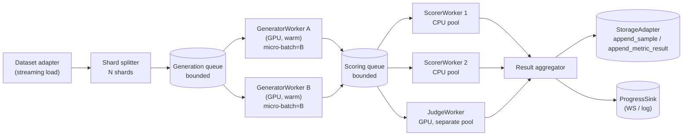
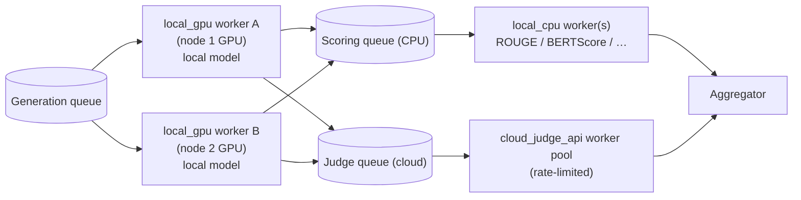
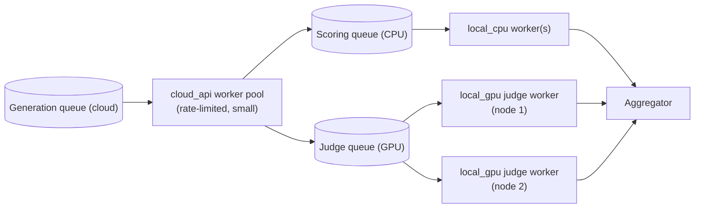

# Execution Engine — Local and Distributed

## Context and Problem Statement

LLM evaluation has two operationally distinct stages with different performance shapes:

- **Generation** is GPU-bound (or remote-API-bound), expensive to cold-start, and benefits massively from keeping a warm worker that processes micro-batches.
- **Scoring** is mostly CPU-bound (lexical metrics, embedding metrics on small models, JSON parsing) with the exception of LLM-as-judge metrics which are themselves generation workloads on a possibly different model. Scoring is embarrassingly parallel.

The high-level architecture document (§7) is explicit about the constraint: the framework must run end-to-end on a single GPU-constrained workstation, *and* must scale across nodes when more hardware is available, *with the same code path*. Switching to "production scale" should be a config change, not a rewrite.

We need a concrete decision on:

1. The `ExecutionEngine` abstraction itself — what does it do, what does it not do, what does it return.
2. Two concrete engines that ship in v1: a `LocalEngine` for single-process workstation use and a `DistributedEngine` for multi-worker / multi-node use.
3. The pipeline shape (stages, queues, batching, backpressure) that both implementations honor.
4. Failure semantics, idempotency, and how a partially-completed run is finalized.
5. The broker / scheduler choice for the distributed implementation.

This ADR is the largest single binding decision in the framework: every adapter, metric, and persistence call ultimately runs *under* an engine, so changing the engine contract later would force a cascade of updates.

## Decision Drivers

- **Single binary, two modes:** developers running on a laptop should not install Redis. Operators running a cluster should not refactor application code.
- **GPU efficiency:** the warm-worker / micro-batch pattern is non-negotiable. Pure "one-row-one-task" distribution wastes the GPU.
- **Pipeline parallelism:** generation and scoring should overlap so the GPU does not idle while the CPU pool catches up.
- **Per-row observability:** the user expects every dataset row to be tracked in the broker (per high-level architecture §7.2), even when generation is micro-batched on the worker.
- **Strict typing:** the engine boundary is one of the most critical typed seams in the framework. No `Dict[str, Any]` between engine and adapter / metric / persistence.
- **Failure transparency:** a single-sample failure should never silently drop a row. Failures land in the result with the exception class and message.

## Considered Options

For the distributed scheduler:

- **Celery + Redis**
- **Ray**
- **Dask (distributed)**
- **RQ + Redis**
- **Prefect / Dagster (workflow orchestrators)**

For the engine abstraction itself, there is one realistic choice: a typed `ExecutionEngine` Protocol with two concrete implementations, captured in the Decision Outcome.

## Decision Outcome

Adopt a single typed `ExecutionEngine` Protocol with **two concrete v1 implementations** (`LocalEngine` and `DistributedEngine`) that share the same internal pipeline shape. The distributed implementation uses **Celery + Redis** as its broker, with the abstraction explicitly designed not to foreclose a future `RayEngine` if and when GPU-aware scheduling demands it.

### 1. The `ExecutionEngine` Protocol

```python
class ExecutionEngine(Protocol):
    spec: EngineConfig  # Pydantic (defined in aef.contracts.run; same model the CLI builds via hydra-zen)

    async def run(
        self,
        request: EvaluationRunRequest,
        storage: StorageAdapter,
        progress: ProgressSink | None = None,
    ) -> EvaluationRunResult: ...

    async def cancel(self, run_id: str) -> None: ...

    async def close(self) -> None: ...
```

- `run()` is the single entry point. It returns a fully-populated `EvaluationRunResult`. Persistence happens incrementally during the run (via `storage.append_*`), but the `run_id` is created up front and the final result is also written via `storage.finalize_run(...)`.
- `progress` (a Pydantic-shaped `ProgressSink` Protocol) emits per-sample progress events that the API server's WebSocket layer broadcasts to the dashboard. `LocalEngine` calls it directly; `DistributedEngine` writes to a Redis pub/sub channel that the API server tails.
- `cancel(run_id)` requests a cooperative cancellation: in-flight samples are allowed to finish or fail explicitly, but no new work is pulled. The run's final status is `partial` if it terminated with completed samples, otherwise `cancelled`.
- `close()` flushes worker pools, releases GPU memory in the local case, and tells brokered workers to drain in the distributed case.

The Protocol is intentionally narrow. Anything richer (multirun sweeps, scheduling between runs) is the CLI / API's job, not the engine's.

### 2. The shared pipeline shape

Both engines run a **two-stage pipeline**: `generation` then `scoring`. Both stages are queue-coupled with bounded depth, both stages are pool-based, and both stages micro-batch where it pays off.



Five non-negotiable properties, both engines:

1. **Sharded distribution + intra-shard micro-batching.** The dataset is split into shards (`shard_count = max(1, num_generator_workers)`). Each generator worker pulls its shard's tasks, then runs micro-batches of size `B` (configurable, default `B=1` for local-HF, low number for cloud APIs subject to per-call rate limits) across its warm GPU.
2. **Pipeline parallelism between stages.** While generator A produces micro-batch *N+1*, the scorer pool processes the outputs of micro-batch *N*. The scoring queue absorbs jitter.
3. **Separate worker pools.** Generation workers are GPU-pinned and long-lived (model stays loaded). Scoring workers are CPU pool members for lexical/embedding metrics. LLM-as-judge scoring is a *third* pool, GPU-pinned, because a judge is itself a generation workload — colocating it with the main generator would step on the same GPU. Pool sizes are independent.
4. **Backpressure with bounded queues.** Each stage has a `max_queue_depth` (configurable, default `2 * pool_size * B`). When full, upstream blocks. This prevents OOMs on large datasets and bounds memory.
5. **One row = one logical task.** Even though generation is micro-batched on the worker, the broker tracks per-row state. Workers pull `B` ready tasks and process them as a batch. This preserves the "isolated request" mental model the user asked for in high-level architecture §5 *without* sacrificing GPU throughput.

### 3. `LocalEngine`

- Single Python process. All "queues" are `asyncio.Queue` instances. All "workers" are `asyncio.Task` coroutines.
- The generator worker uses `asyncio.to_thread` (or a process pool, if the adapter declares `requires_gpu=True` and we want GIL-free batching) to run blocking framework calls.
- Micro-batching is implemented by the worker reading up to `B` ready items off the queue with a small timeout, then invoking the adapter's `generate_batch(...)` if exposed (preferred), or N parallel `generate(...)` calls if not.
- `ProgressSink.emit(...)` is a direct method call.
- This is the default engine. No external services required. No Docker required. `aef-eval` works out of the box.

> **Brief on `asyncio` for context.** `asyncio` is Python's stdlib cooperative-concurrency runtime. A function declared with `async def` is a *coroutine*; `await` inside it suspends until some I/O or scheduled work completes, while letting other coroutines run on the same OS thread. `asyncio.Queue` lets coroutines hand items between stages without locks (the queue is single-event-loop). `asyncio.create_task(...)` spawns a coroutine to run alongside others.
>
> The `LocalEngine` uses `asyncio` precisely because the work it coordinates is mostly *waiting*: waiting on a model SDK to return a generation, waiting on a database write, waiting on a metric to finish on a thread pool. While one coroutine is waiting, others run, and pipeline parallelism (generation overlapping with scoring) emerges naturally. The pipeline shape in this ADR is therefore implementable in one process without spawning OS threads for every stage.
>
> `asyncio` is **not** a fit for CPU-bound or blocking calls — those would freeze the event loop. We push such work to a worker thread (`asyncio.to_thread(...)`), a process pool, or a dedicated worker process. Per ADR-0010 we run pyright strict, which catches missing `await` and accidental coroutine returns at type-check time before they become silent stalls in production.

### 4. `DistributedEngine`

- One **broker process** (the engine instance running inside the API server or the CLI) coordinates the run: it shards the dataset, schedules tasks, listens for results, and finalizes the run.
- One or more **worker containers** (or worker processes on different hosts) connect to the same Redis broker and consume tasks from per-stage queues:
  - `aef.generation` queue → generator workers (GPU).
  - `aef.scoring.cpu` queue → CPU scorer workers.
  - `aef.scoring.judge` queue → GPU judge workers.
- Celery handles the wire protocol, retries, acks, and per-queue routing. Redis is the broker; we additionally use Redis as Celery's result backend for v1 (the engine still writes durable results through `StorageAdapter`; Redis just holds in-flight task state).
- `ProgressSink.emit(...)` publishes to `aef:run:<run_id>:progress` on Redis pub/sub. The API server's WebSocket layer subscribes per active run and forwards events to clients.
- Configuration:
  - `engine.kind: distributed`
  - `engine.broker_url: redis://localhost:6379/0` (configurable; only used in distributed mode)
  - `engine.queues.generation.pool_size`, `.scoring_cpu.pool_size`, `.scoring_judge.pool_size`
  - `engine.queues.*.max_queue_depth`
  - `engine.micro_batch_size: B`
  - `engine.acks_late: true` (Celery setting; preserves work on worker crash)

### 5. Worker-pool placement: cloud vs local, mixed scenarios

The pipeline is intentionally pool-agnostic about *where* a generation or scoring task runs — workers are categorized by what they need, not by which physical adapter they wrap. Each Celery queue is keyed by a typed `WorkerPoolKind` so that mixing local-GPU and cloud-API workloads in the same run is a configuration choice, not a code path.

```python
WorkerPoolKind = Literal[
    "local_gpu",        # GPU-pinned worker hosting a local model (HF, Ollama)
    "local_cpu",        # CPU pool: lexical / embedding scorers
    "cloud_api",        # rate-limited remote-API worker (OpenAI, Anthropic, ...)
    "cloud_judge_api",  # rate-limited remote-API worker hosting an LLM judge
]
```

Pool selection at run start is driven by the adapter's existing capabilities (per ADR-0003): an adapter with `is_remote=True` lands in a `cloud_api` (or `cloud_judge_api` for judges) queue; an adapter with `requires_gpu=True` and `is_remote=False` lands in `local_gpu`; embedding/lexical scorers land in `local_cpu`. The engine's queue routing table is therefore derived from capabilities — not configured by hand.

Pool sizing rules of thumb:

- **Local model generation** scales with GPU count. One `local_gpu` worker per GPU, micro-batch on each warm worker. Adding nodes adds GPUs adds throughput linearly until the dataset is exhausted.
- **Cloud-API generation** scales with provider concurrency limits, *not* node count. A small pool of `cloud_api` workers (2–8, depending on the provider's quota) is usually enough; scaling beyond the rate limit just produces 429s and idle workers.
- **Local LLM-as-judge scoring** scales with judge-model GPU count. Distribute across `cloud_judge_api` is replaced by `local_gpu` workers in the *judge* pool — same shape as local generation.
- **Cloud LLM-as-judge scoring** scales the same way as cloud generation: a small `cloud_judge_api` pool sized to the provider's quota.

#### Scenario A — local generation, cloud judge (the common case)

A multi-node cluster runs the local model on each node's GPU; an LLM-as-judge metric calls a cloud API for scoring.



Sizing: many `local_gpu` workers (one per available GPU), one `local_cpu` pool sized to the available CPU cores, a small `cloud_judge_api` pool sized to the provider's quota. Even if the cluster has many nodes, the judge pool stays small; spare nodes contribute to generation, not judging.

#### Scenario B — cloud generation, local judge across nodes

Generation is delegated to a cloud LLM API; LLM-as-judge runs a local judge model on each available GPU node.



Sizing: a small `cloud_api` generation pool (provider rate limit decides the upper bound), a CPU pool, and as many `local_gpu` judge workers as there are GPU nodes. Multi-node distribution helps the judge pool, not generation.

#### Does distribution still make sense for cloud adapters?

Yes, but for different reasons. With local adapters, distributing across nodes adds compute capacity. With cloud adapters, distributing adds *concurrency up to the provider's rate limit* and lets the framework keep generation, scoring, and judging on independent queues with their own backpressure. A single overloaded API worker would otherwise stall the whole pipeline. Even in single-node setups, separating cloud-API workers into their own pool means provider-side rate-limit errors do not back-pressure CPU scoring and vice versa.

If a deployment runs entirely on one machine but mixes a local generation model with a cloud judge, `LocalEngine` already gives this for free: each pool is just a separate group of `asyncio` tasks, with the local-GPU pool sized to 1 and the cloud-judge pool sized to whatever fits under the provider quota. `DistributedEngine` simply formalizes the same shape across processes.

### 6. Failure semantics

- Per-sample failures are recorded as `MetricResult(status=error, exception_class=..., exception_message=...)`. The run continues.
- Per-stage exceptions on a worker propagate the same way: the row is marked failed for the affected metric set, the engine continues.
- The engine itself only fails the entire run on adapter-construction errors, dataset-load errors, or storage-write errors. These are infrastructure-level and not recoverable by skipping a row.
- Workers are idempotent on a per-task basis. Restart is safe. Celery's `acks_late=True` plus per-task `task_id = hash(run_id, sample_idx, stage)` lets a crashed worker's task be re-claimed without producing duplicate database rows (the storage adapter's append paths are upsert-keyed on `(run_id, sample_idx, metric_name)`).
- A run's final status, per ADR-0006:
  - `succeeded` — every sample completed successfully for every metric.
  - `partial` — completed, but at least one sample errored.
  - `failed` — engine-level failure (storage, dataset, adapter construction).
  - `cancelled` — user invoked `cancel(run_id)`.

### 7. Hydra / config integration

Engine selection lives in the `engine` config group (per ADR-0007):

- `engine=local` — `LocalEngine` with sensible single-laptop defaults.
- `engine=distributed` — `DistributedEngine`. Refuses to start if `engine.broker_url` is not reachable (validation step in `aef.cli.config`).

Pool sizes, queue depths, and micro-batch size are overridable per run:

```bash
aef-eval engine=distributed engine.queues.generation.pool_size=4 engine.micro_batch_size=16
```

### 8. Why Celery + Redis (not Ray, Dask, RQ, Prefect/Dagster)

- **Celery + Redis** is the v1 default. Reasons:
  1. Mature, widely deployed Python broker. Operations-readiness is a known quantity.
  2. Per-queue routing maps directly onto our pool layout (`aef.generation`, `aef.scoring.cpu`, `aef.scoring.judge`).
  3. `acks_late` + idempotent task IDs gives us crash-safe semantics without writing scheduler logic.
  4. Redis is also used for pub/sub on progress events — one external service, two purposes.
  5. Easy local bring-up with a single Redis container; nothing forces us to run Compose for distributed mode (the user can `redis-server` on the same box, or run Redis in one container, while the backend stays local under `uv`).
- **Ray** is the documented escape hatch for the future. It has genuinely better GPU-aware scheduling (actor model + GPU resource constraints) and is the right choice if the framework grows into multi-tenant GPU pools. The `ExecutionEngine` Protocol is intentionally Ray-compatible so a `RayEngine` is a plug-in successor, not a fork.
- **Dask** has stronger dataframe ergonomics but weaker GPU awareness and weaker semantics around long-lived warm workers. Wrong shape for this workload.
- **RQ + Redis** is lighter than Celery, but the gap closes once we want per-stage routing keys, scheduled retries with exponential backoff, and `acks_late`. By that point we've reimplemented the parts of Celery we'd be using.
- **Prefect / Dagster** are workflow orchestrators sitting at a different abstraction level. They are a great fit for *between-run* orchestration (CI sweeps, scheduled benchmarks, dataset rebuilds) but bring far too much for *intra-run* per-sample task scheduling. They could sit *above* the engine someday; they should not replace it.

### Non-goals

- We are NOT shipping a `RayEngine` in v1. The Protocol leaves the door open; that's all.
- We are NOT shipping a Kubernetes operator, Helm chart, or Terraform module for cluster deployment. Cluster deployment lives in a future infrastructure ADR.
- We are NOT supporting cross-run scheduling inside the engine. Hydra multirun (ADR-0007) handles cross-run sweeps; the engine sees one run at a time.
- We are NOT building our own task queue. Either Celery exists and works, or Ray exists and works; we will not write custom protocol code.
- We are NOT exposing engine internals (worker addresses, queue lengths in absolute numbers) through the API. The API exposes per-run progress events; cluster operators read worker health from Celery / Redis tooling directly.

### Consequences

- Good, because `LocalEngine` and `DistributedEngine` are real implementations of the same Protocol. Code that runs against one runs against the other. Tests in `tests/integration/engine_local/` cover the shared pipeline; `tests/integration/engine_distributed/` (gated by `@pytest.mark.broker`) covers Celery wiring.
- Good, because the sharded + micro-batched + pipeline-parallel design captures the user's "isolated per-row request" mental model *and* keeps GPU utilization high. We do not have to choose.
- Good, because Celery's per-queue routing maps directly onto our pool layout. There's no scheduler hand-rolling.
- Good, because failure semantics are uniform between engines: a row error is a recorded `MetricResult` with `status=error`, never a silent drop.
- Good, because Redis pub/sub gives us live progress streaming for the dashboard with one extra component (already required for the broker). The frontend's Evaluation Runner card subscribes to a single `WS /runs/{run_id}/progress` endpoint.
- Bad, because Celery has historically been operationally heavy (broker connection management, worker restart loops, version skew between client and worker). We pin Celery, Redis, and `kombu` to known-good versions and document Compose / systemd recipes in a future infrastructure ADR; v1 does not promise turnkey cluster deployment.
- Bad, because micro-batching introduces a small latency floor (the worker waits up to `micro_batch_timeout_ms` to fill a batch). Users running interactive evals on tiny datasets will see this. Mitigation: `LocalEngine` defaults `micro_batch_timeout_ms=0` if `dataset.row_count <= micro_batch_size`, falling back to single-call behavior on small inputs.
- Bad, because choosing Celery now slightly closes the door on stronger GPU scheduling (Ray's `num_gpus=0.5` style fractional allocation) until a `RayEngine` lands. Acceptable: most workloads in scope for v1 want one model per GPU, and the Protocol does not foreclose Ray later.
- Neutral, because keeping per-row tracking in the broker doubles the message count (one task per row instead of one task per micro-batch). Redis handles this comfortably at the scales we care about; it's the right cost for the visibility users expect.

## Implementation Plan

- **Affected paths**:
  - `backend/src/aef/engine/__init__.py` — re-exports `ExecutionEngine`, `LocalEngine`, `DistributedEngine`, `ProgressSink`. The `EngineConfig` Pydantic model itself lives in `aef.contracts.run` (single source of truth, consumed by both the engine and the CLI).
  - `backend/src/aef/engine/base.py` — `ExecutionEngine` Protocol, `ProgressSink` Protocol, `MicroBatchPolicy`, `QueueDepthPolicy`. (Engine reads `EngineConfig` from `aef.contracts.run`; there is no separate `EngineSpec` model.)
  - `backend/src/aef/engine/pipeline.py` — shared shard splitter, micro-batch puller, queue plumbing helpers consumed by both engines.
  - `backend/src/aef/engine/local.py` — `LocalEngine` (asyncio).
  - `backend/src/aef/engine/distributed.py` — `DistributedEngine` (Celery client side).
  - `backend/src/aef/engine/celery_app.py` — Celery app definition with three queues and the task functions for each stage.
  - `backend/src/aef/engine/workers/generation.py`, `scoring_cpu.py`, `scoring_judge.py` — per-stage worker entrypoints.
  - `backend/tests/integration/engine_local/` — pipeline integration tests using `MockChatModel` and `MockJudge`.
  - `backend/tests/integration/engine_distributed/` — Celery + Redis tests, gated `@pytest.mark.broker`.
  - `configs/engine/local.yaml`, `configs/engine/distributed.yaml` — Hydra-zen-built specs (per ADR-0007).
  - `compose/distributed.yml` (optional, future) — minimal Compose for Redis + worker containers, to be locked in by a future infrastructure ADR.
- **Dependencies (optional groups)**:
  - `engine-distributed` group: `celery>=5.4,<6`, `redis>=5,<6`, `kombu>=5.4` (transitively pulled by Celery; pin to avoid version skew issues).
  - The `LocalEngine` requires no additional dependencies beyond what ADR-0002 already declares (`asyncio` is stdlib).
- **Patterns to follow**:
  - Both engines wrap their main loop in `with timed("engine.run")` and `with run_context(run_id=..., stage="setup" | "generation" | "scoring" | "persist")` from ADR-0012, so telemetry and logging context propagate.
  - Both engines call `storage.append_sample(...)` and `storage.append_metric_result(...)` in short transactions; neither holds a long-running transaction across the whole run.
  - The Celery task functions are *thin*: they construct adapters / metrics from the run's spec, call into the same per-sample function as `LocalEngine`, and return a Pydantic-shaped result. There is no business logic that lives only in Celery tasks.
  - `ProgressSink` payloads are typed Pydantic events (`SampleStarted`, `SampleCompleted`, `SampleFailed`, `StageStarted`, `StageCompleted`, `RunFinalized`); never `Dict[str, Any]`.
  - `EngineConfig.queues.generation.pool_size` defaults are: `LocalEngine` → `1` (single GPU), `DistributedEngine` → `0` (operator-supplied; the engine refuses to start without an explicit number).
- **Patterns to avoid**:
  - Do NOT have the Celery tasks talk to `StorageAdapter` directly — the engine does. Tasks return their result; the engine writes it. This keeps task functions stateless and lets the engine batch DB writes if it wants to.
  - Do NOT reach across worker process boundaries with shared state. Tasks are pure functions of their input plus the immutable `EvaluationRunRequest`.
  - Do NOT special-case any adapter inside the engine. Per-adapter behavior lives behind the Protocol (capabilities, tokenizer, micro-batch support).
  - Do NOT use Celery's chord / chain / group features for cross-stage coordination. Stage coordination is the engine's job; tasks are flat.
  - Do NOT use Redis for anything other than (a) Celery's broker / result backend and (b) the progress pub/sub channel. Run results are durable in `StorageAdapter`.
  - Do NOT block the event loop on long-running synchronous adapter calls. Wrap them in `asyncio.to_thread` or run them in a process pool.
- **Configuration**:
  - `engine.kind: "local" | "distributed"`.
  - `engine.broker_url: str` (only consulted when `kind=distributed`).
  - `engine.micro_batch_size: int` (default `8` local; `1` cloud-API by default — adapter capability hints can refine this).
  - `engine.micro_batch_timeout_ms: int` (default `25`).
  - `engine.queues.generation.pool_size`, `engine.queues.scoring_cpu.pool_size`, `engine.queues.scoring_judge.pool_size`.
  - `engine.queues.*.max_queue_depth`.
  - `engine.acks_late: bool` (default `true`; only consulted when `kind=distributed`).
- **Migration steps**: greenfield.

### Verification

- [ ] `aef.engine.base.ExecutionEngine` is a `Protocol` with exactly `run`, `cancel`, `close`, and `spec`.
- [ ] `LocalEngine` and `DistributedEngine` both satisfy the Protocol under pyright strict mode.
- [ ] `LocalEngine` runs the default `aef-eval` invocation end-to-end with `MockChatModel` and `MockDatasetAdapter` without any external service.
- [ ] `DistributedEngine` refuses to start when `engine.broker_url` is unreachable, with a clear error.
- [ ] With Redis available and at least one of each worker kind running, `DistributedEngine` produces an `EvaluationRunResult` byte-identical (modulo timing fields) to `LocalEngine` on the same input and seeded mock adapters.
- [ ] A run with one row that intentionally raises in the model adapter produces `runs.status='partial'`, `metric_results` rows for the failed sample have `status='error'` with the exception class and message, and the run completes for all other rows.
- [ ] `cancel(run_id)` from a separate process / API call stops new task pickup; the run finalizes within `cancel_grace_seconds` with `status='cancelled'` (no completed samples) or `'partial'` (some samples completed).
- [ ] The progress channel emits typed Pydantic events; the API WebSocket forwards them with the same shape (verifiable via a contract test).
- [ ] Pool size, queue depth, and micro-batch size in `engine.queues.*` are reflected in actual Celery `worker_concurrency`, queue prefetch, and adapter `generate_batch` calls.
- [ ] No file under `backend/src/aef/engine/workers/` constructs a `StorageAdapter` directly — workers are pure.
- [ ] No file under `backend/src/aef/` other than `aef.engine.distributed*` imports `celery` or `redis`.

## Pros and Cons of the Options

### Celery + Redis

- Good, because per-queue routing (`aef.generation`, `aef.scoring.cpu`, `aef.scoring.judge`) maps directly onto our pool layout.
- Good, because mature operational story: known retry semantics, known monitoring tools (Flower), known horizontal scaling behavior.
- Good, because Redis is reusable for the progress pub/sub channel — one external service for two purposes.
- Good, because `acks_late` plus idempotent task IDs gives crash-safe per-row semantics with no scheduler hand-rolling.
- Neutral, because Celery is somewhat heavyweight for the absolute simplest case (single laptop). `LocalEngine` is what we ship for that case.
- Bad, because Celery / Redis version skew between client and worker has historically caused subtle bugs. Mitigated by version pins and a `compose/distributed.yml` reference setup.
- Bad, because no fractional GPU resource scheduling out of the box. Mitigated by per-pool worker counts that already model "one worker per GPU".

### Ray

- Good, because it is the strongest GPU-aware scheduler in the Python ecosystem. Native `num_gpus=0.5` semantics and actor lifetime management are exactly the operations we'd reach for in a multi-tenant GPU pool.
- Good, because Ray's actor model fits long-lived warm workers cleanly.
- Good, because Hydra's `RayLauncher` could later orchestrate sweeps on the same cluster (out of scope for v1, but a path exists).
- Neutral, because Ray's deployment model (head node + workers + dashboard) is more involved than a Redis instance for the simple case.
- Bad, because adding Ray now is a sizeable upfront investment for benefits we cannot demonstrate before we have a real GPU cluster to evaluate against. We pay the cost twice: now (writing it) and later (replacing it if the workload shape changes).
- Bad, because Ray is harder to reason about under failure than Celery — workers and actors can fail in more interesting ways.
- Verdict: keep as the documented escape hatch via the `ExecutionEngine` Protocol; do not adopt as the v1 default.

### Dask (distributed)

- Good, because excellent dataframe ergonomics and a mature client-side API.
- Good, because Python-native scheduling that doesn't require a separate broker process.
- Neutral, because dataset-as-DataFrame is not how we model evaluation rows; we'd be using only the futures API, which is less differentiated.
- Bad, because GPU scheduling is weaker than Ray and not really better than Celery's pool-pinning.
- Bad, because long-lived warm workers are not an idiomatic Dask pattern.
- Verdict: rejected for v1.

### RQ + Redis

- Good, because RQ is genuinely simpler than Celery and shares the Redis dependency.
- Good, because the operational surface area is smaller.
- Neutral, because for a strict subset of our needs (single queue, no retries) it would suffice.
- Bad, because adding per-stage routing keys, retry policies with exponential backoff, and `acks_late` means we'd reimplement the half of Celery we'd otherwise be using.
- Bad, because RQ's Python-only nature precludes future polyglot workers if we ever needed them.
- Verdict: rejected — Celery is only marginally more complex to set up and gives us features we will reach for.

### Prefect / Dagster (workflow orchestrators)

- Good, because excellent observability and DAG-style workflow support out of the box.
- Good, because a great fit for *between-run* orchestration (CI sweeps, scheduled regression benchmarks, dataset preparation jobs).
- Bad, because they are at the wrong abstraction level for *per-row* task scheduling. Each row is not a workflow; the run is.
- Bad, because adding either as the per-row scheduler would couple our entire engine to their ecosystem.
- Verdict: rejected as the engine; both remain candidates for a future "pipeline orchestrator" sitting *above* the engine, in a separate ADR.

## More Information

- High-level architecture: [`../high_level_architecture.md`](../high_level_architecture.md) §7 (entire section), §11.5.
- External references:
  - [Python `asyncio` documentation](https://docs.python.org/3/library/asyncio.html) — cooperative concurrency runtime used by `LocalEngine`.
  - [Celery documentation](https://docs.celeryq.dev/) — distributed task queue used by `DistributedEngine`.
  - [Redis documentation](https://redis.io/docs/latest/) — broker / result-backend candidate for Celery.
  - [Ray documentation](https://docs.ray.io/) — future alternative if GPU-aware scheduling becomes a requirement.
  - [Dask documentation](https://docs.dask.org/) — evaluated alternative for distributed computation.
  - [Prefect documentation](https://docs.prefect.io/) and [Dagster documentation](https://docs.dagster.io/) — orchestration tools explicitly kept above, not inside, the execution engine.
- Related ADRs:
  - [`0003-adapter-architecture-for-models-and-datasets.md`](0003-adapter-architecture-for-models-and-datasets.md) — adapter capabilities (`max_context_tokens`, `supported_sampling_parameters`) drive engine validation and scheduling.
  - [`0006-persistence-sqlite-default-postgres-swap-in.md`](0006-persistence-sqlite-default-postgres-swap-in.md) — the engine writes through `StorageAdapter`. SQLite write contention under `DistributedEngine` is the documented Postgres trigger.
  - [`0007-cli-configuration-with-hydra-and-hydra-zen.md`](0007-cli-configuration-with-hydra-and-hydra-zen.md) — `engine=local` / `engine=distributed` config groups; CLI multirun is for *between-run* sweeps and does not replace the engine.
  - [`0011-testing-strategy-and-mock-adapters.md`](0011-testing-strategy-and-mock-adapters.md) — engine integration tests live under `tests/integration/engine_local/` and `tests/integration/engine_distributed/` (latter gated `@pytest.mark.broker`).
  - [`0012-logging-and-telemetry-contract.md`](0012-logging-and-telemetry-contract.md) — engine wraps its main loop in `run_context` and `timed` so progress events, telemetry, and logs all share `run_id` / `stage` / `sample_idx`.
  - [`0014-llm-as-judge-contract-and-bias-mitigation.md`](0014-llm-as-judge-contract-and-bias-mitigation.md) — the LLM-as-judge pool is the third worker pool described here.
- Revisit triggers:
  - GPU pool sharing or fractional GPU allocation becomes a real requirement — design and adopt a `RayEngine` (the Protocol already permits it).
  - SQLite write contention under `DistributedEngine` becomes the bottleneck — execute the Postgres swap from ADR-0006 and update both ADRs.
  - Cross-run orchestration (scheduled regression benchmarks, dataset prep) becomes a recurring need — adopt Prefect or Dagster *above* the engine, never inside it.
  - Celery 6 changes the connection / acks model — re-pin and verify; replace only if it would force code churn larger than the swap cost.
