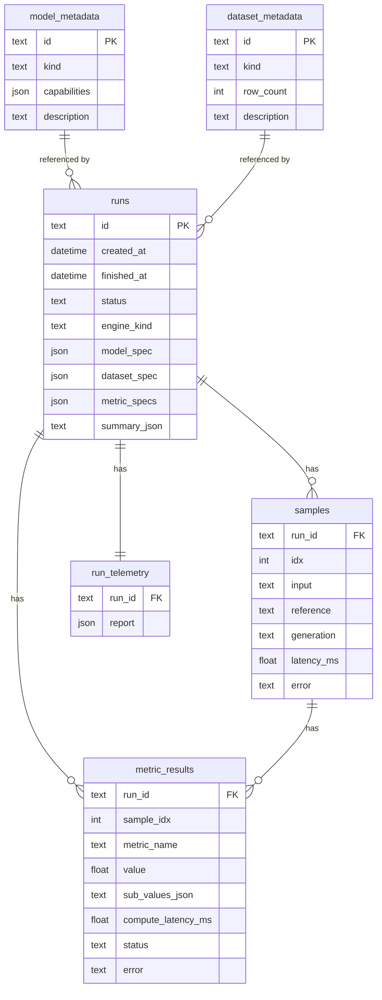

# Persistence — SQLite Default, Postgres Swap-In

## Context and Problem Statement

The framework needs a persistent store of evaluation runs. The high-level architecture document is opinionated about why:

- Every backend run, regardless of entry point (library, CLI, API), must land in a structured store so the dashboard's Run History card can query and compare runs (§5.3).
- The CLI additionally writes a complete artifact tree under `outputs/<date>/<time>/` containing `result.json`, `metrics_summary.csv`, plots, and Hydra's saved config (§4).
- The frontend must NEVER read the database directly — it always queries through the backend HTTP/WS API (§5.2, §6).
- Storage is reached through a `StorageAdapter` interface so that swapping engines later is purely a configuration change (§6.3).
- For initial single-device development, SQLite is the right default; a future heavy multi-worker `DistributedEngine` may force Postgres (§11.5).

Without a concrete decision on schema, ORM patterns, migration tooling, transaction boundaries, and the exact `StorageAdapter` shape, every layer (engine, API, CLI, dashboard) ends up re-inventing access code. We also need to be unambiguous about how the file-on-disk artifacts and the database rows relate to each other so a `result.json` and a SQLite row never disagree.

This ADR locks in the persistence layer's contract.

## Decision

Adopt the following persistence design.

### 1. Default engine — SQLite, embedded

- **Engine:** SQLite, accessed via SQLAlchemy 2.x async (`sqlalchemy[asyncio]`) over `aiosqlite`.
- **Default URL:** `sqlite+aiosqlite:///./.aef/aef.sqlite3`. The `.aef/` directory is created on first run and is `.gitignore`d.
- **WAL mode:** enabled at startup (`PRAGMA journal_mode=WAL`). This significantly improves concurrent read performance at the cost of slightly more files on disk and is essential as soon as the API server reads while a CLI run is writing.
- **Foreign keys:** enabled at startup (`PRAGMA foreign_keys=ON`). SQLite ignores foreign keys by default unless this pragma is set per connection.
- **Synchronous mode:** `PRAGMA synchronous=NORMAL` (rather than `FULL`), trading a small durability window for substantially better write throughput. Acceptable because losing the trailing milliseconds of a run on power loss is fine — the run can be re-executed.

### 2. Postgres as the documented swap-in

- **When:** SQLite stops being adequate when (a) `DistributedEngine` workers regularly write to the DB concurrently and the single-writer lock becomes the bottleneck, or (b) a deployment needs to be queried from multiple hosts simultaneously.
- **How:** the swap is a configuration change. Set `AEF_DATABASE_URL=postgresql+asyncpg://...` and run `alembic upgrade head`. No code changes are required, because:
  - All schema is portable across SQLite and Postgres (no `JSONB`-only operators, no Postgres array columns, no SQLite-only types).
  - All ORM models use generic SQLAlchemy 2.x types (`Mapped[str]`, `Mapped[datetime]`, `Mapped[float]`, `Mapped[int | None]`, `Mapped[bytes]`, etc.).
  - `StorageAdapter` does not expose engine-specific operations.
- **Not in v1:** we do not ship a Postgres bring-up script, Compose service, or migration tooling beyond the standard Alembic flow. A future cluster-deployment ADR (referenced in §7.4 of the high-level architecture) will own that work.

### 3. `StorageAdapter` Protocol

The protocol exposes the operations the engine, API, and CLI actually need — nothing more. It is the only surface that any non-persistence code consumes.

```python
class StorageAdapter(Protocol):
    async def create_run(self, request: EvaluationRunRequest) -> RunRecord: ...
    async def append_sample(self, run_id: str, sample: SampleRecord) -> None: ...
    async def append_metric_result(
        self, run_id: str, result: MetricResultRecord
    ) -> None: ...
    async def finalize_run(
        self, run_id: str, summary: RunSummary, telemetry: TelemetryReport
    ) -> EvaluationRunResult: ...

    async def get_run(self, run_id: str) -> EvaluationRunResult: ...
    async def list_runs(
        self, query: RunQuery
    ) -> RunListPage: ...
    async def delete_run(self, run_id: str) -> None: ...

    async def upsert_model_metadata(self, meta: ModelMetadataRecord) -> None: ...
    async def upsert_dataset_metadata(self, meta: DatasetMetadataRecord) -> None: ...
    async def list_model_metadata(self) -> list[ModelMetadataRecord]: ...
    async def list_dataset_metadata(self) -> list[DatasetMetadataRecord]: ...
```

Notes:

- All shapes are Pydantic — the adapter never returns ORM objects directly.
- Append-style writes during a run keep transactions short; writers do not have to hold a long-running transaction across an entire dataset.
- `RunQuery` is a typed Pydantic model carrying filter and pagination fields (status, date range, adapter kind, free-text on title, page/limit).
- The Protocol does NOT expose raw SQL or session objects. Any code that needs to do something the Protocol does not allow must extend the Protocol or move into the persistence layer.

### 4. Schema (initial)

Five primary tables; everything else lives downstream of these.

#### Entity-relationship sketch



#### Field-level notes

- `runs.id` — opaque string (UUIDv7 preferred for sortable insertion). Used as the run identifier everywhere — `EvaluationRunResult.run_id`, log records, and the `result.json` filename embedded inside `outputs/<...>/`.
- `runs.status` — enum: `pending`, `running`, `succeeded`, `partial`, `failed`. `partial` means at least one sample errored but the run completed.
- `runs.model_spec`, `runs.dataset_spec`, `runs.metric_specs` — stored as **JSON text** (SQLite has no native JSON column type but accepts JSON via its `json1` extension, available in stock builds). Postgres uses `JSON` (not `JSONB`) for portability. We tolerate the extra parse cost because run specs are read rarely after the run completes.
- `samples.idx` — zero-based row index inside the dataset shard, monotonic within a run. Composite primary key with `run_id`.
- `metric_results.sample_idx` — `NULL` for run-level metrics (e.g., aggregate Self-BLEU). Present for per-sample metrics.
- `metric_results.sub_values_json` — only used when a metric is fundamentally variadic (per-class breakdowns, per-token confidence). Plain scalar metrics fill `value` and leave `sub_values_json` `NULL`.
- `run_telemetry.report` — JSON serialization of `TelemetryReport` from ADR-0012. Stored separately from `runs` because telemetry can be large; the dashboard's run-list view does not need it for every row.
- `model_metadata`, `dataset_metadata` — denormalized from the most recent run that referenced them. The `Metadata Viewer` card reads exclusively from these tables.

### 5. Transaction boundaries

- **Run start:** one transaction creates the `runs` row in `pending` status and upserts `model_metadata` / `dataset_metadata`.
- **Per sample:** one short transaction inserts the `samples` row plus all of its `metric_results`. This bounds the lock window and lets `append_*` calls interleave between workers without long-held write locks.
- **Run finalize:** one transaction updates `runs.status`, `runs.finished_at`, `runs.summary_json`, and inserts the `run_telemetry` row.

`StorageAdapter` is the only code that owns sessions and transactions. Engine, API, and CLI code never touch SQLAlchemy sessions directly.

### 6. Migrations — Alembic

- **Tool:** Alembic, configured to use the SQLAlchemy declarative metadata as its source.
- **Versioning:** sequential alembic revisions in `backend/src/aef/persistence/migrations/versions/`.
- **Workflow:** every PR that changes the ORM models also commits a generated migration. `alembic upgrade head` is part of the application startup path for both API and CLI; in a multi-worker future this is centralized into a one-shot init job, but for v1 the embedded auto-upgrade is fine.
- **Downgrades:** every revision implements `downgrade()`. We do not promise downgrade-on-production, but we keep the option for local dev.

### 7. Filesystem artifacts (CLI and API, partitioned by entry point)

- Every run produces a `result.json` (canonical Pydantic dump of `EvaluationRunResult`) plus `metrics_summary.csv` and a `plots/` subfolder. The artifact tree is partitioned by entry point so concurrent runs cannot collide:

  | Entry point            | Artifact tree                                                         |
  | ---------------------- | --------------------------------------------------------------------- |
  | CLI (`aef-eval`)       | `outputs/cli/<date>/<time>-<run_id>/`                                 |
  | API server / dashboard | `outputs/frontend/<date>/<time>-<run_id>/`                            |
  | Library callers        | `outputs/lib/<date>/<time>-<run_id>/` (configurable; can be disabled) |

- The CLI tree additionally contains `.hydra/` (the resolved YAML composition) and a per-run `run.log`. The API tree contains a per-run `run.log` but no `.hydra/` (no Hydra composition for API-launched runs).
- `result.json.run_id` matches `runs.id` in the database. Either artifact can be used to find the other.
- Filesystem artifacts are **derived** from the database after `finalize_run`. If a run completes but artifact serialization fails, the database row is still authoritative and the artifacts can be regenerated by the `aef-report` script.
- The API server additionally maintains a separate, single rotating _server_ log file (`outputs/frontend/server.log` by default; path configurable via `AEF_API_LOG_PATH`) that captures uvicorn startup, request access logs, and background-task output. This file is NOT a per-run artifact and is NOT written into any run's `result.json`. ADR-0012 owns the handler / formatter setup; ADR-0007 owns the path scheme.
- The Angular frontend never writes to the filesystem; "frontend" in the artifact tree path labels the run's _user-facing source_, while the actual writer is the backend API process.

### 8. Privacy and PII

- Sample inputs and references are stored verbatim. We do not redact or hash them — evaluation requires the actual text.
- Adapter secrets (API keys, tokens) are NEVER stored in any column. The `model_spec` JSON is filtered against the same secrets allow-list defined in ADR-0012 before persistence; values are replaced with `"<redacted>"`.
- A future privacy ADR may add an "ephemeral run" mode that drops sample text after metric computation; this is not in v1.

### Non-goals

- We are NOT supporting MySQL, MS SQL, or any other dialect in v1.
- We are NOT building a query layer (filtering, pagination) more elaborate than `RunQuery`. Complex analytics happen in `result.json` artifacts or in the dashboard.
- We are NOT exposing the SQLAlchemy session directly to non-persistence modules.
- We are NOT promising downgrade-clean migrations for production.
- We are NOT storing model weights, logits, or tokenizer state in the database. Outputs are the final response text plus structured per-sample metrics.

## Consequences

- Good, because SQLite is zero-ops: a single file under `.aef/`, no service to install or run, no port to manage. New contributors run `uv sync && alembic upgrade head` and the dashboard works.
- Good, because the ORM models are dialect-portable. The day Postgres becomes necessary, the change is `AEF_DATABASE_URL` and a re-run of `alembic upgrade head`.
- Good, because the `StorageAdapter` Protocol gives the engine, API, and CLI a single, typed entry into persistence. There is no second back door.
- Good, because storing run specs as JSON keeps the schema stable when adapter shapes evolve. New adapter capabilities don't force migrations on the `runs` table.
- Bad, because SQLite's single-writer lock will become a bottleneck under heavy concurrent writes from a `DistributedEngine`. The persistence ADR explicitly documents this as the trigger to switch to Postgres rather than to engineer SQLite past its limits (e.g., per-shard databases, sharded merging).
- Bad, because storing JSON-as-text gives up engine-level indexing on its contents. We accept this — most queries against `runs` filter on `created_at`, `status`, and `engine_kind`, all of which are first-class columns.
- Bad, because Alembic auto-upgrade on application startup is not appropriate for production-scale Postgres deployments. The future cluster ADR will replace it with an explicit init job; in v1 the dev ergonomics win.
- Neutral, because `model_metadata` and `dataset_metadata` are denormalized. They drift from `runs.model_spec` if a model definition changes server-side; this is acceptable because the spec stored on the run is the immutable, reproducible source of truth, and the metadata tables are dashboard cache.

## Implementation Plan

- **Affected paths**:
  - `backend/src/aef/persistence/__init__.py` — re-exports `StorageAdapter`, `SQLiteStorage`, `RunQuery`, etc.
  - `backend/src/aef/persistence/base.py` — `StorageAdapter` Protocol and the Pydantic record models (`RunRecord`, `SampleRecord`, `MetricResultRecord`, `RunQuery`, `RunListPage`, `RunSummary`, `ModelMetadataRecord`, `DatasetMetadataRecord`).
  - `backend/src/aef/persistence/sqlite.py` — `SQLiteStorage` concrete implementation.
  - `backend/src/aef/persistence/orm.py` — SQLAlchemy 2.x typed declarative models (`Run`, `Sample`, `MetricResult`, `RunTelemetry`, `ModelMetadata`, `DatasetMetadata`) plus a single `Base = DeclarativeBase`.
  - `backend/src/aef/persistence/session.py` — `SessionLocal` async session factory and pragma setup helpers.
  - `backend/src/aef/persistence/migrations/env.py`, `script.py.mako`, `versions/0001_initial.py`.
  - `backend/src/aef/api/routers/runs.py`, `models.py`, `datasets.py` — these routers go through `StorageAdapter` exclusively.
  - `backend/src/aef/cli/__init__.py` — uses `StorageAdapter` for DB writes, then writes `outputs/<...>/result.json` etc.
  - `backend/tests/integration/persistence/` — round-trip tests for runs, samples, metric results, telemetry, and `RunQuery`.
- **Dependencies**:
  - Already declared in ADR-0002: `sqlalchemy>=2.0,<3`, `alembic>=1.13`, `aiosqlite>=0.20`.
  - For the future Postgres swap-in: `asyncpg>=0.29`, `psycopg[binary]>=3.2`. Listed in an optional dependency group `db-postgres` so v1 installs don't pull them.
- **Patterns to follow**:
  - All ORM classes inherit from one `Base = DeclarativeBase` declared once in `persistence/orm.py`.
  - All ORM columns use `mapped_column(...)` with explicit `Mapped[T]` annotations; no legacy `Column(...)` style.
  - `SQLiteStorage` enables WAL, foreign keys, and `synchronous=NORMAL` via a SQLAlchemy `event.listens_for(engine.sync_engine, "connect")` hook. The Postgres implementation skips these pragmas.
  - Reading existing rows: build a SELECT, hydrate into the Pydantic record model, return that. Never return ORM objects from `StorageAdapter`.
  - Writing: explicit `session.add(...)` plus `await session.commit()`. No `expire_on_commit=False` shortcuts that hide stale state.
- **Patterns to avoid**:
  - Do NOT construct SQLAlchemy `AsyncSession` outside `aef.persistence` in production code (`backend/src/aef/`). Tests under `backend/tests/` may construct sessions via the `in_memory_db` fixture (ADR-0011) for ORM-layer testing only.
  - Do NOT use SQLite-specific SQL (`AUTOINCREMENT`, `WITHOUT ROWID`, JSON1 path operators) or Postgres-specific SQL (`JSONB ->`, `ANY()`, `ON CONFLICT ... DO UPDATE` outside of the SQLAlchemy `insert(...).on_conflict_do_update(...)` portable form).
  - Do NOT bypass migrations by hand-editing the database file.
  - Do NOT log raw secrets through SQLAlchemy's echo logger; the redaction filter from ADR-0012 wraps connection strings.
  - Do NOT store API keys in any column. The `model_spec` JSON is redacted before persistence.
- **Configuration**:
  - `AEF_DATABASE_URL` env var. Default: `sqlite+aiosqlite:///./.aef/aef.sqlite3`. Postgres values match SQLAlchemy's `postgresql+asyncpg://...`.
  - `AEF_DATABASE_AUTO_UPGRADE` env var (`true`/`false`, default `true` in v1). When true, `alembic upgrade head` runs on application startup. Set to `false` in environments that prefer explicit migration steps.
  - `.aef/` is added to `.gitignore`.
- **Migration steps**: greenfield. The first Alembic revision (`0001_initial.py`) creates all six tables.

### Verification

- [ ] `alembic upgrade head` succeeds against a fresh `sqlite+aiosqlite:///:memory:` URL.
- [ ] `alembic upgrade head` succeeds against a fresh `postgresql+asyncpg://...` URL provisioned in CI behind the `broker`/`docker` markers (or a one-off compatibility job).
- [ ] `StorageAdapter` is implemented by `SQLiteStorage` and satisfies the Protocol per pyright strict mode.
- [ ] No file under `backend/src/aef/` outside `backend/src/aef/persistence/` imports `sqlalchemy.orm` or constructs an `AsyncSession`. Tests under `backend/tests/` are intentionally exempt (the `in_memory_db` fixture from ADR-0011 yields an `AsyncSession` for ORM-internal tests under `backend/tests/unit/persistence/` and `backend/tests/integration/persistence/`).
- [ ] No file under `backend/src/aef/` outside `backend/src/aef/persistence/` imports `aiosqlite` or `asyncpg`.
- [ ] A run created via `create_run(...)`, populated via `append_sample(...)` and `append_metric_result(...)`, and finalized via `finalize_run(...)` is retrievable via `get_run(run_id)` with byte-identical Pydantic content.
- [ ] WAL mode is in effect after startup (verifiable via `PRAGMA journal_mode;` returning `wal`).
- [ ] Foreign-key enforcement is in effect (`PRAGMA foreign_keys;` returns `1`).
- [ ] Inserting a `samples` row whose `run_id` does not exist fails with a foreign-key error.
- [ ] `runs.model_spec` and `runs.dataset_spec` round-trip through `model_dump()` / `model_validate()` for every adapter that ships in v1.
- [ ] Storing a `model_spec` containing a field named `api_key` redacts the value to `"<redacted>"` before insert.
- [ ] CLI run produces `outputs/<...>/result.json` whose `run_id` matches the row in `runs`, and re-running the run is forbidden with the same `run_id`.

## Alternatives Considered

- **Postgres from day one**: rejected. Adds a service to run, manage, and back up before the framework has any users. The portability of SQLite plus a clean swap path captures most of the benefit at none of the cost.
- **DuckDB**: considered. Strong analytics story, embedded like SQLite. Rejected for v1 because the workload is primarily transactional (append rows during a run, query rows on the dashboard). DuckDB shines when the workload is OLAP-style aggregations over large columnar data. We can revisit if a future use case (e.g., cross-run analytics over many runs) justifies it.
- **Filesystem-only persistence (no DB)**: rejected. The dashboard's Run History card requires queries (filter, sort, page) that are clumsy and slow against a folder of JSON files. The user explicitly added Run History to the architecture during planning, so DB-backed persistence is non-negotiable.
- **A schemaless document store (TinyDB, JSON-line files)**: rejected for the same reason as filesystem-only — query power is the bottleneck.
- **Storing run specs as multiple normalized rows** (one row per metric, etc.): rejected. The schema becomes brittle as adapter shapes evolve; JSON-text columns absorb spec changes without migrations and the schema is still queryable on the columns we actually filter by.
- **Direct frontend → SQLite access** (e.g., via a server-side WebAssembly SQLite proxy): rejected outright. The frontend never touches the database; the API is the contract.

## More Information

- High-level architecture: [`../high_level_architecture.md`](../high_level_architecture.md) §3.1, §4, §5.2, §6, §11.5.
- External references:
  - [SQLite documentation](https://www.sqlite.org/docs.html) — embedded database engine and transaction behavior.
  - [SQLAlchemy 2.0 documentation](https://docs.sqlalchemy.org/en/20/) — ORM / Core persistence layer.
  - [Alembic documentation](https://alembic.sqlalchemy.org/) — migration management.
  - [PostgreSQL documentation](https://www.postgresql.org/docs/) — swap-in persistence target.
  - [Python `sqlite3` documentation](https://docs.python.org/3/library/sqlite3.html) — stdlib SQLite driver behavior.
- Related ADRs:
  - [`0002-backend-technology-stack.md`](0002-backend-technology-stack.md) — establishes SQLAlchemy 2.x and Alembic as the persistence stack.
  - [`0003-adapter-architecture-for-models-and-datasets.md`](0003-adapter-architecture-for-models-and-datasets.md) — adapter specs are what gets serialized into `runs.model_spec` and `runs.dataset_spec`.
  - [`0012-logging-and-telemetry-contract.md`](0012-logging-and-telemetry-contract.md) — `TelemetryReport` is the shape stored in `run_telemetry.report`.
  - [`0005-execution-engine-local-and-distributed.md`](0005-execution-engine-local-and-distributed.md) — `DistributedEngine` writes through `StorageAdapter` exactly like `LocalEngine`; multi-writer behavior is the trigger for the Postgres swap.
  - [`0009-frontend-docker-dev-environment.md`](0009-frontend-docker-dev-environment.md) — frontend Docker dev environment confirms the frontend never reads the database directly.
- Revisit triggers:
  - SQLite write contention measurably degrades throughput under `DistributedEngine` — execute the documented Postgres swap and update this ADR's status (deprecating "SQLite default").
  - A user requirement appears for cross-run aggregations that SQL feels awkward for — consider DuckDB as a read-side complement, not a replacement.
  - PII / privacy requirements escalate — open a follow-up ADR for an ephemeral-run mode.
