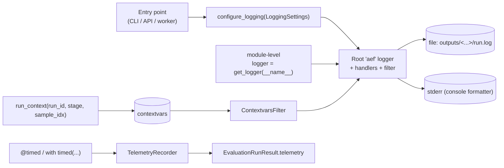

# Logging and Telemetry Contract

## Context and Problem Statement

The high-level architecture document (§3.4 and §9.6) makes two strong commitments about observability:

1. Every Python module imports a logger via a single factory call (`aef.observability.logging.get_logger(__name__)`); there is no `print()`.
2. Execution timings and latencies are tracked at four granularities (per-sample-generation, per-sample-metric, per-stage, per-run) and included in the final `EvaluationRunResult`.

These commitments only pay off if the supporting code is uniform. If every module configures its own handlers, formats, or output streams, log output becomes opaque, latency tracking diverges, and the dashboard cannot reliably reconstruct a run's timeline. Conversely, if the logger factory and timing primitives are too rigid, contributors will route around them.

We need a concrete contract: a single logging entry point, a single set of timing primitives, and a stable schema for the telemetry block that lands inside `EvaluationRunResult`. The same primitives must work in three execution contexts:

- The CLI (Hydra-managed log directory under `outputs/<date>/<time>/`).
- The FastAPI server process (long-lived, log rotation enabled).
- Distributed worker processes (per-worker log files plus structured records aggregated back to the run).

## Decision

Define a single observability module, `aef.observability`, that owns logging configuration and timing primitives for the entire backend. All non-test Python code in the framework consumes its public surface and never configures handlers, formats, or sinks directly.

### 1. Logger factory

Every module obtains its logger via:

```python
from aef.observability.logging import get_logger

logger = get_logger(__name__)
```

Behavior:

- Returns a `logging.Logger` whose name equals `__name__`, ensuring the originating module is preserved in every record.
- The returned logger inherits handlers and formatters from the root `aef` logger configured by `configure_logging(...)`. Module-level loggers have NO handlers attached directly.
- Calling `get_logger` is idempotent: configuration is set up exactly once per process by the appropriate entry point (CLI, API, worker), then `get_logger` is a thin lookup.

### 2. Logging configuration

A single `configure_logging(settings: LoggingSettings) -> None` function configures the root `aef` logger and is called exactly once, early, by:

- `aef.cli` after Hydra resolves the run directory. The file handler points at `outputs/cli/<date>/<time>-<run_id>/run.log`.
- `aef.api.app` during FastAPI startup. Two file handlers are attached:
  1. A rotating *server* handler at `outputs/frontend/server.log` (path overridable via `AEF_API_LOG_PATH`) that captures uvicorn / FastAPI / background-task records — i.e., everything that is not bound to a specific run.
  2. A per-run handler that is added dynamically when an API-launched run starts and removed when it finishes. The file path is `outputs/frontend/<date>/<time>-<run_id>/run.log`. This handler uses a `logging.Filter` that only admits records whose contextvars carry the matching `run_id`, so concurrent API runs each get their own clean log file.
- Each distributed worker entrypoint (with rotation and a worker-id-prefixed file under `outputs/frontend/workers/<worker-id>.log`, since workers are part of the API-side execution path).

In all cases the same console handler is also attached so terminal output keeps working as developers expect. JSON mode is the default for file handlers; console mode is the default for the stderr handler when a TTY is attached.

`LoggingSettings` is a Pydantic model with explicit fields — `level`, `format` (`"json"` | `"console"`), `file_path: Path | None`, `rotation: RotationSettings | None`, `redact_secrets: bool`. No `Dict[str, Any]`.

Two formatters ship by default:

- **`json`** — structured records suitable for ingestion by a log aggregator. Fields: `ts`, `level`, `logger`, `message`, `run_id`, `sample_idx`, `stage`, plus any extras supplied via `logger.info("...", extra={...})` constrained to a registered allow-list.
- **`console`** — colorized human-readable format for local dev.

The choice between stdlib `logging` and Loguru noted in §9.6 is resolved here in favor of **stdlib `logging`** with a JSON formatter (`python-json-logger`). Reasoning is in Alternatives Considered.

### 3. Run-scoped context

Every log record produced during an evaluation run carries:

- `run_id: str` — the same identifier used as the `EvaluationRunResult.run_id` and the SQLite primary key.
- `sample_idx: int | None` — the dataset row, when applicable.
- `stage: Literal["setup", "generation", "scoring", "persist", "teardown"]` — the pipeline stage.

These are injected via `contextvars` so that adapter and metric code never has to thread them through manually:

```python
from aef.observability.context import run_context

async with run_context(run_id=run_id, stage="generation", sample_idx=i):
    response = await adapter.generate(request)
```

A `logging.Filter` reads the contextvars and adds the values to every record produced inside the `async with` block.

### 4. Timing primitives

Two equivalent primitives, both backed by the same internal recorder:

```python
@timed("phase_name")
async def some_phase() -> ...: ...

with timed("phase_name") as t:
    ...
```

`timed` records:

- The phase name (free-form but conventionally one of: `generation`, `metric.<metric_name>`, `dataset.load`, `persist`, `judge.<judge_name>`, etc.).
- The wall-clock duration.
- The contextvars in scope (`run_id`, `sample_idx`, `stage`).
- An exception class, if the block raised.

Records are appended to a `TelemetryRecorder` keyed by `run_id`. The recorder's contents are exposed via a `dump_run(run_id) -> TelemetryReport` method invoked at run completion and serialized into `EvaluationRunResult.telemetry`.

### 5. Telemetry schema

`EvaluationRunResult.telemetry` is a Pydantic model with this shape (illustrative):

```python
class TimingRecord(BaseModel):
    phase: str
    duration_ms: float
    sample_idx: int | None
    stage: Literal["setup", "generation", "scoring", "persist", "teardown"]
    exception_class: str | None

class StageSummary(BaseModel):
    stage: Literal["setup", "generation", "scoring", "persist", "teardown"]
    total_ms: float
    samples_processed: int
    p50_ms: float
    p95_ms: float
    p99_ms: float
    error_count: int

class ThroughputCounters(BaseModel):
    generation_tokens_per_sec: float | None
    scoring_samples_per_sec: float | None
    queue_depths: list[QueueDepthSample]

class TelemetryReport(BaseModel):
    run_id: str
    started_at: datetime
    finished_at: datetime
    total_duration_ms: float
    per_record: list[TimingRecord]
    per_stage: list[StageSummary]
    counters: ThroughputCounters
```

The `per_record` list is the source of truth; `per_stage` and `counters` are computed at the end of the run. The dashboard's run-history view reads `per_stage` and `counters` directly; deeper drill-down uses `per_record`.

### 6. OpenTelemetry (deferred but reserved)

The high-level architecture flags OTel as a future, flag-gated addition (§9.6). This ADR reserves the integration shape: `aef.observability.telemetry` will expose `start_span(name, **attributes)` that, when `AEF_OTEL_ENABLED=1`, emits an OpenTelemetry span via OTLP in addition to recording an internal `TimingRecord`. When disabled, only the internal recorder runs. This keeps the in-tree telemetry contract stable regardless of whether OTel is wired up, and avoids inventing a competing tracing API.

### Non-goals

- We are NOT shipping a hosted log aggregator integration in v1. JSON output to a file is enough; piping to ELK / Loki / Datadog is operator-side configuration.
- We are NOT exposing per-token timing (e.g., time-to-first-token) as part of the v1 telemetry schema. It can be added as an optional field on `GenerationResponse` later.
- We are NOT supporting multiple simultaneous logging configurations in the same process. `configure_logging` is one-shot.
- We are NOT supporting Loguru. Stdlib `logging` is the only logging backend.

## Consequences

- Good, because the logger factory makes module identity automatic — every record carries `aef.adapters.models.huggingface` (or wherever it originated) without any per-module setup.
- Good, because contextvars-based run/stage/sample propagation means adapter and metric code does not need to know about the surrounding pipeline. New adapters get correct logging metadata for free.
- Good, because the telemetry schema is part of `EvaluationRunResult`, so the CLI's `result.json` and the dashboard's run history view share the exact same data. No extra plumbing.
- Good, because reserving the OTel shape lets us add distributed tracing later as a strict superset, not a rewrite.
- Bad, because contextvars require contributors to remember to enter `run_context(...)` in entry points. Mitigation: the engine is the only code that actually starts a run, and it sets the context once at the top of `engine.run(...)`.
- Bad, because every log record carrying `run_id`/`sample_idx`/`stage` makes log output verbose in console mode. Mitigation: the console formatter renders these compactly (e.g., `[run=ab12 stage=gen sample=42]`), JSON mode preserves full fidelity.
- Bad, because `TimingRecord` per sample × per metric scales linearly with dataset size. For a 100k-row evaluation that is bounded but non-trivial (a few MB). Mitigation: the persistence ADR may downsample `per_record` if it crosses a threshold; `per_stage` and `counters` are always retained.
- Neutral, because choosing stdlib over Loguru gives up some ergonomics (Loguru's catch decorator, ANSI colors out of the box) but gains universal interoperability with libraries that already use `logging`.

## Implementation Plan

- **Affected paths**:
  - `backend/src/aef/observability/__init__.py` — re-exports `get_logger`, `configure_logging`, `timed`, `run_context`, `start_span`.
  - `backend/src/aef/observability/logging.py` — `get_logger`, `configure_logging`, `LoggingSettings`, formatters, the contextvars filter.
  - `backend/src/aef/observability/context.py` — `run_context`, contextvar definitions.
  - `backend/src/aef/observability/timing.py` — `timed` decorator and context manager, `TelemetryRecorder`.
  - `backend/src/aef/observability/telemetry.py` — `TelemetryReport` Pydantic model, OTel `start_span` reservation.
  - `backend/src/aef/contracts/run.py` — adds `telemetry: TelemetryReport` to `EvaluationRunResult`.
  - `backend/src/aef/cli/__init__.py` (or wherever the CLI entry lives) — calls `configure_logging` once, after Hydra resolves the run directory.
  - `backend/src/aef/api/app.py` — calls `configure_logging` during FastAPI startup.
  - `backend/src/aef/engine/local.py` and `backend/src/aef/engine/distributed.py` — enter `run_context(run_id=..., stage=...)` at the top of the run, switch `stage` between generation and scoring as the pipeline proceeds.
  - `backend/tests/unit/observability/` — tests for the formatter, contextvars filter, and telemetry round-trip.
- **Dependencies**:
  - `python-json-logger` — pinned (e.g., `>=2.0,<3`).
  - No Loguru.
  - OpenTelemetry SDK (`opentelemetry-sdk`, `opentelemetry-exporter-otlp`) is **not** a v1 dependency. It is added later when the OTel feature lands.
- **Patterns to follow**:
  - Every Python module that wants to log starts with `logger = get_logger(__name__)` at module top.
  - Every adapter and metric reads from `run_context.current()` for `run_id`/`stage`/`sample_idx` if it needs them; it does not accept these as constructor arguments.
  - Every long-running phase is wrapped in `with timed("...")` or decorated with `@timed("...")` to ensure the telemetry block is populated.
  - Use `logger.exception(...)` (not `logger.error(...)`) inside `except` blocks so the traceback is captured.
- **Patterns to avoid**:
  - Do NOT call `logging.basicConfig(...)`, `logging.getLogger(...)` directly, or `print(...)` anywhere in `aef.*`.
  - Do NOT add handlers to module-level loggers.
  - Do NOT pass `run_id`, `sample_idx`, or `stage` through every function signature; use the contextvars.
  - Do NOT log secrets. The redaction filter (`redact_secrets=True`) masks any field whose name matches `api_key`, `token`, `authorization`, or `secret` (case-insensitive). Adapters that accept secret material must label those fields accordingly in their Pydantic specs.
  - Do NOT include `Dict[str, Any]` payloads in `extra=`. Use a registered, typed extras allow-list.
- **Configuration**:
  - `AEF_LOG_LEVEL` env var (`DEBUG`/`INFO`/`WARNING`/`ERROR`), defaults to `INFO`.
  - `AEF_LOG_FORMAT` env var (`json`/`console`), defaults to `console` in dev (TTY detected) and `json` otherwise.
  - `AEF_OTEL_ENABLED` env var, defaults to `0`. Reserved for future use.
- **Migration steps**: none — greenfield.

### Logging flow



### Verification

- [ ] `aef.observability.logging.get_logger(name)` returns a `logging.Logger` whose `.name` equals `name`.
- [ ] `configure_logging(...)` is idempotent: a second call in the same process is a no-op (or a warning), not a duplicate handler set.
- [ ] No file under `backend/src/aef/` calls `logging.basicConfig`, attaches handlers to a non-root logger, or uses `print(`. Verifiable via `rg`.
- [ ] Every public adapter, engine, metric, and persistence module calls `get_logger(__name__)` at module top.
- [ ] A run executed end-to-end produces an `EvaluationRunResult.telemetry` populated with `per_record`, `per_stage`, and `counters`, and `total_duration_ms` matches wall-clock duration within tolerance.
- [ ] Records emitted inside `run_context(run_id="X", stage="generation", sample_idx=5)` carry those fields.
- [ ] In `json` mode, every record is a single line of valid JSON containing at minimum `ts`, `level`, `logger`, `message`.
- [ ] Setting `AEF_LOG_FORMAT=console` in a TTY produces a colorized format with the `[run=... stage=... sample=...]` prefix.
- [ ] Setting `redact_secrets=True` (the default) masks any extras field whose name matches the secrets allow-list.
- [ ] `aef.observability.telemetry.start_span(...)` exists and is callable; with `AEF_OTEL_ENABLED=0` (default) it is a no-op span and does not import OpenTelemetry.

## Alternatives Considered

- **Loguru** as the logging backend. Considered. Pros: zero-config, beautiful output, structured logging out of the box. Cons: the framework has many third-party dependencies (`transformers`, `langgraph`, etc.) that emit logs through stdlib `logging`. Standardizing on stdlib means we get all of those for free; standardizing on Loguru would require a stdlib-to-Loguru bridge anyway. Net cost > net benefit.
- **OpenTelemetry as the v1 telemetry backbone**, with the in-tree `TimingRecord` being a thin wrapper. Considered. Rejected for v1 because OTel adds a non-trivial dependency tree and a hard requirement to run a collector for spans to be useful. The framework should be runnable on a single laptop with no external services. Reserving the `start_span` shape for later avoids the worst lock-in cost.
- **Per-module configuration** (each module attaches its own file handler under Hydra's run directory). Rejected because it duplicates code, confuses log rotation, and makes structured logging impossible to enforce.
- **Threadlocals instead of contextvars** for run-scoped context. Rejected because the framework is async-heavy; contextvars are the correct primitive for async-safe context propagation in Python 3.13.
- **Embedding telemetry inside each `MetricResult`** instead of a top-level `telemetry` block. Considered. Rejected because timings span more than just metrics (dataset load, generation, persistence); a top-level block is the single, queryable place for everything.

## More Information

- High-level architecture: [`../high_level_architecture.md`](../high_level_architecture.md) §3.4, §9.6, §11.4.
- External references:
  - [Python `logging` documentation](https://docs.python.org/3/library/logging.html) — logger hierarchy, handlers, filters, and formatters.
  - [Python `contextvars` documentation](https://docs.python.org/3/library/contextvars.html) — run-scoped context propagation across async tasks.
  - [OpenTelemetry documentation](https://opentelemetry.io/docs/) — future tracing / metrics integration path.
  - [FastAPI events / lifespan documentation](https://fastapi.tiangolo.com/advanced/events/) — API startup hook where logging is configured.
  - [Pydantic documentation](https://docs.pydantic.dev/latest/) — `TelemetryReport` schema validation.
- Related ADRs:
  - [`0002-backend-technology-stack.md`](0002-backend-technology-stack.md) — Pydantic v2 and FastAPI underpin the schema and entry points.
  - [`0003-adapter-architecture-for-models-and-datasets.md`](0003-adapter-architecture-for-models-and-datasets.md) — adapters consume `run_context` for free; the LangGraph adapter additionally records internal trace events into the telemetry block.
  - [`0005-execution-engine-local-and-distributed.md`](0005-execution-engine-local-and-distributed.md) — execution engine wraps every stage in `run_context` and `timed`.
  - [`0011-testing-strategy-and-mock-adapters.md`](0011-testing-strategy-and-mock-adapters.md) — testing strategy adds a fixture that asserts no `print()` and no orphan handlers exist after a test run.
- Revisit triggers:
  - The framework adopts a hosted observability backend as a first-class feature — promote OTel from `start_span` reservation to a real dependency.
  - `per_record` size becomes a problem for large datasets — add downsampling or compaction in the persistence layer.
  - A hard need emerges for sub-millisecond timing precision (e.g., GPU kernel-level instrumentation) — extend `TimingRecord` rather than introducing a parallel system.
