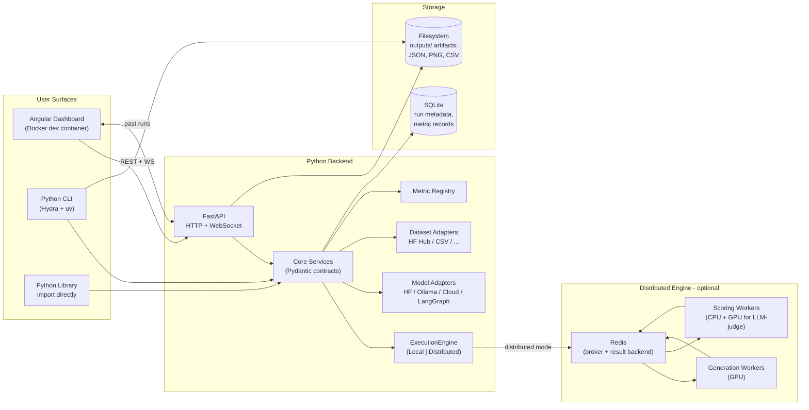
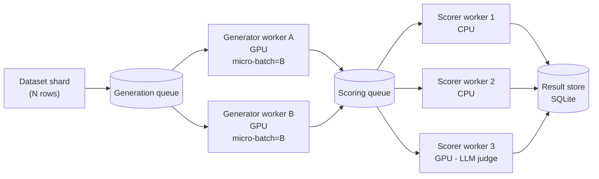

# Agentic Evaluation Framework — High-Level Architecture

> **Status:** Draft v0.1 — for review before ADR generation.
> **Scope:** Text-in, text-out evaluation of LLMs and agentic graphs. Internal tools and RAG within agentic graphs are permitted, but the user-facing interface is strictly text.
> **Audience:** Future contributors and coding agents. This document is the canonical mental model for the system; deeper trade-off rationale will live in ADRs.

---

## 1. Goals and Non-Goals

### 1.1 Goals

- Provide a **uniform evaluation pipeline** for four model surfaces: Hugging Face local models, Ollama models, cloud LLM APIs, and LangGraph agentic graphs.
- Treat **model adapters** and **dataset adapters** as pluggable. Adding a new model runtime or dataset format must require no changes outside the new adapter.
- Ship a **rich default metric suite** (lexical, embedding-based, learned, and LLM-as-judge) with first-class support for adding custom metrics.
- Run end-to-end on a **single GPU-constrained workstation** (e.g., `SmolLM`-class models) with the same code path that scales to a **multi-node cluster** when more hardware is available.
- Enforce **strict typing** (Pydantic + Pyright on Python, per [ADR-0010](adr/0010-code-quality-standards.md); strict TypeScript on Angular) and produce evaluation artifacts that are machine-validatable.
- Provide **three entry points**: a Python library, a Hydra-driven CLI, and an Angular dashboard.

### 1.2 Non-Goals

- Multimodal (vision, audio) evaluation. Text-in, text-out only.
- Production model serving. We evaluate; we do not host inference for end users.
- Online / continuous evaluation against live traffic. Offline batch evaluation only.
- Multi-tenant SaaS. The dashboard targets local/team use; auth is out of scope for v1.
- Building a new LLM training/fine-tuning loop. We consume models, we don't train them.

---

## 2. System Overview



### 2.1 Three Layers, One Core

The backend Python package is the **single source of truth**. Both the CLI and the FastAPI service import the same core. The frontend never bypasses the API.

| Layer        | Language | Runtime                           | Purpose                                                                     |
| ------------ | -------- | --------------------------------- | --------------------------------------------------------------------------- |
| **Backend**  | Python   | uv-managed venv, FastAPI server   | Adapters, engines, metrics, persistence, API.                               |
| **CLI**      | Python   | `python -m` entry point + Hydra   | Headless evaluation runs; writes a complete artifact tree to `outputs/`.    |
| **Frontend** | Angular  | Docker dev container (`ng serve`) | Configure runs, browse model/graph metadata, view past runs, read the blog. |

### 2.2 Top-level repository layout

`backend/`, `cli/`, and `frontend/` are siblings at the repo root. A uv workspace `pyproject.toml` and `uv.lock` live at the root; `configs/`, `outputs/`, and developer-tooling files are also root-level peers. This is the binding layout for v1 (see [ADR-0002](adr/0002-backend-technology-stack.md), [ADR-0007](adr/0007-cli-configuration-with-hydra-and-hydra-zen.md), [ADR-0009](adr/0009-frontend-docker-dev-environment.md), [ADR-0010](adr/0010-code-quality-standards.md)):

```
<repo root>/
  pyproject.toml                    # workspace root (AgenticEvaluationFramework)
  uv.lock
  backend/                          # Python library + FastAPI (import: backend)
    pyproject.toml
    contracts/  api/  engine/  …    # flat package; see §3.1
    tests/
    README.md
  cli/                              # Hydra CLI (import: cli; depends on backend)
    pyproject.toml
    entrypoint.py  config.py  …
    tests/
    README.md
  frontend/                         # Angular dashboard (dev-container only; per ADR-0009)
    Dockerfile
    package.json
    proxy.conf.json
    src/app/
  configs/                          # Hydra YAML + hydra-zen-built configs (ADR-0007)
    config.yaml
    model/  dataset/  metrics/  engine/  sampling/  output/
  outputs/                          # run artifacts, partitioned by entry point (ADR-0006 §7)
    cli/        2026-05-18/20-15-03-<run_id>/...
    frontend/   server.log, 2026-05-18/20-32-11-<run_id>/...
    lib/        2026-05-18/...                          # optional
  adr/                              # this directory; the ADR index lives in adr/README.md
  high_level_architecture.md        # this file
  Makefile                          # convenience targets: frontend-install, frontend, check, ...
  .pre-commit-config.yaml           # ADR-0010 hooks
  .github/workflows/                # ci.yml + scheduled jobs for gated test markers
  .gitignore                        # excludes .aef/, outputs/, node_modules/, dist/
  .aef/                             # local SQLite + caches (gitignored; ADR-0006)
```

The CLI resolves `configs/` via a workspace-root anchor (relative to the repo root from `cli`), so commands run from anywhere inside the repo still find the same composition.

---

## 3. Backend

### 3.1 Module Layout (target)

```
backend/
  __init__.py
  config/                       # pydantic-based settings, env loading
  contracts/                    # ALL Pydantic models (no nested dicts allowed)
        run.py
        sample.py
        metric_result.py
        adapter_spec.py
      adapters/
        models/
          base.py                 # ModelAdapter Protocol
          huggingface.py
          ollama.py
          openai.py               # representative cloud adapter
          langgraph.py
          mocks.py                # MockChatModel, MockJudge
        datasets/
          base.py                 # DatasetAdapter Protocol
          huggingface.py
          csv.py
          mocks.py
      metrics/
        base.py                   # Metric Protocol
        registry.py
        lexical/                  # bleu, rouge, ngram, fuzzy, exact_match, chrf, meteor
        embedding/                # semantic_similarity, bertscore
        learned/                  # llm_as_judge (with judge adapter)
        rag/                      # conditional: faithfulness, answer_relevancy, retrieval metrics when context/traces exist
        operational/              # latency, tokens, cost
      engine/
        base.py                   # ExecutionEngine Protocol
        local.py                  # in-process, single-machine
        distributed.py            # Celery-backed; optional dependency
      persistence/
        base.py                   # StorageAdapter Protocol
        sqlite.py                 # default
        orm.py                    # SQLAlchemy 2.x typed declarative models
        session.py                # async SessionLocal factory + pragma setup
        migrations/               # Alembic environment
      api/
        app.py                    # FastAPI app factory
        routers/
          runs.py
          models.py
          datasets.py
          metrics.py
          ws.py                   # progress/log streaming
        schemas.py                # request/response models (subset of contracts)
      observability/
        logging.py                # logger factory used everywhere
        timing.py                 # timed() ctx manager + decorator
        telemetry.py              # latency/throughput counters
  tests/
    unit/
    integration/
    fixtures/
  pyproject.toml
```

### 3.2 Adapter Architecture

Every external surface (model, dataset, storage, judge) is reached through a typed adapter. Adapters are **stateless after construction** and registered in a central registry keyed by string identifier so they can be selected from config files.

```python
class ModelAdapter(Protocol):
    spec: ModelAdapterSpec  # Pydantic; describes config, capabilities, metadata
    async def generate(self, request: GenerationRequest) -> GenerationResponse: ...
    async def close(self) -> None: ...
```

- `GenerationRequest` / `GenerationResponse` are Pydantic models. No nested dicts cross adapter boundaries.
- Capabilities (streaming, tool-use, max-context, GPU residency) are declared in `spec` so the engine can reason about scheduling.
- `MockChatModel` and `MockJudge` are first-class adapters used in unit tests, fixtures, and offline development.
- Default lightweight local model: **SmolLM** family, served via the Hugging Face adapter.

### 3.3 Data Contracts

All inbound and outbound shapes are Pydantic. Highlights:

- `EvaluationRunRequest` — model spec, dataset spec, metric spec list, engine config, generation config.
- `EvaluationSample` — a single row: `input`, `reference`, optional `metadata` (typed sub-model, never `Dict[str, Any]`).
- `GenerationConfig` — runtime-configurable generation/sampling parameters that the user can override per run when the underlying adapter supports them: `temperature`, `top_k`, `top_p`, `repetition_penalty`, `max_output_tokens`, plus optional `seed`. Every field is `Optional[T]`; `None` means "use the adapter / model default". Each `ModelAdapter` declares which parameters it actually honors via `capabilities.supported_sampling_parameters`. Supplying an unsupported parameter is a hard error by default — silent dropping would let the user think a knob is doing something it isn't.
- `GenerationRequest` — prompt(s) plus the resolved `GenerationConfig` for that call.
- `GenerationResponse` — output text, latency breakdown, token counts, cost (when available).
- `MetricResult` — metric name, value(s), per-sample breakdown, computation latency.
- `EvaluationRunResult` — top-level object the backend always returns; this is what the CLI serializes to JSON and what the frontend renders.

Maximum context window is treated as a **capability** on the model (`capabilities.max_context_tokens`) rather than a per-request knob, because it is a property of the model, not a user choice. The engine validates `prompt_tokens + (max_output_tokens or 0) ≤ max_context_tokens` before sending the request and refuses overflowing samples.

### 3.4 Logging & Telemetry

- Every module imports a named logger via `backend.observability.logging.get_logger(__name__)`. Central configuration controls formatting and handlers, while `__name__` preserves the originating module in each log record. There is no `print()`.
- A `@timed("phase_name")` decorator and a `with timed("phase_name"):` context manager record latencies into the run's telemetry block, which is part of `EvaluationRunResult`.
- Latencies are tracked at four granularities: per-sample-generation, per-sample-metric, per-stage (generation, scoring), per-run.
- Hydra owns log directory layout for the CLI (`outputs/cli/<date>/<time>-<run_id>/`); the API server reuses the same logger handler set, writes a rotating server log under `outputs/frontend/server.log`, and attaches per-run handlers under `outputs/frontend/<date>/<time>-<run_id>/run.log`. See [ADR-0012](adr/0012-logging-and-telemetry-contract.md) for the full handler layout.

---

## 4. CLI

- Entry point: `python -m cli.entrypoint` (console script `aef-eval`).
- The CLI imports the backend as a library; it does not call the HTTP API. This keeps headless runs and Docker-less local use trivial.
- **Hydra** is the only configuration mechanism. YAML files live in `configs/` and are composed into typed Pydantic objects via `hydra-zen` or `hydra` + a small `dataclass → BaseModel` shim.
- Output tree per run, partitioned by entry point so concurrent CLI / dashboard runs cannot collide on the same second:

```
outputs/
  cli/                              # aef-eval invocations
    2026-05-18/
      20-15-03-<run_id>/
        .hydra/                     # Hydra-saved config
        run.log
        result.json                 # canonical EvaluationRunResult dump
        metrics_summary.csv
        plots/
          latency_distribution.png
          metric_score_histogram.png
          metric_correlation_matrix.png
  frontend/                         # API / dashboard-launched runs
    server.log                      # rotating uvicorn / FastAPI server log
    workers/
      worker-<id>.log               # one rotating file per distributed worker
    2026-05-18/
      20-32-11-<run_id>/
        run.log                     # per-run log (no .hydra/ for API-launched runs)
        result.json
        metrics_summary.csv
        plots/
  lib/                              # library callers (optional; can be disabled)
```

- Visualization scripts (`aef-plot`, `aef-report`) read `result.json` to emit the supplemental artifacts. They are pure post-processors and never re-invoke models.
- The CLI **also** writes the run to SQLite (same code path as the API), so a CLI-launched run is immediately visible in the dashboard's history view, and the API server's filesystem artifacts mirror the CLI's so a dashboard run is exportable in the same shape.
- The Angular frontend never writes to the filesystem; "frontend" labels the run's user-facing source while the actual writer is the backend API process.

---

## 5. Frontend

### 5.1 Stack

- Angular (latest LTS) + TypeScript strict mode. **Standalone components only**; **Signals** as the default state primitive, with RxJS reserved for streaming concerns (HTTP, WebSocket). See [ADR-0008](adr/0008-frontend-stack-angular-strict-typescript-plotly-mermaid.md).
- **Tailwind CSS + Angular Material** for styling: Material handles structural primitives (tables, dialogs, autocomplete), Tailwind handles layout and theming refinements.
- `mermaid.js` for graph rendering on the Metadata Viewer.
- **`Plotly.js`** as the v1 chart library, wrapped behind a single `<aef-chart>` component. ngx-charts and ECharts remain documented fallbacks but are not implemented in v1.
- `marked` + `DOMPurify` + `highlight.js` (with optional `katex`) for the Knowledge Base.

### 5.2 Frontend Docker

- The frontend container runs `ng serve` (development mode) only. **No production build is shipped.** This intentionally pins the dev experience and avoids Node/Angular drift between machines. See [ADR-0009](adr/0009-frontend-docker-dev-environment.md) for the dev-container shape.
- The backend runs locally under `uv` during initial development; a backend Docker container is not required for v1.
- Docker Compose is unnecessary while the frontend is the only container. If future distributed development introduces Redis, worker containers, or cloud-like local orchestration, Compose can be introduced then.
- The container reaches the host's backend via `host.docker.internal:8000` and the Angular dev server's proxy (`/api`, `/ws`) — see ADR-0009 §3.
- **Note on SQLite:** SQLite is an embedded database engine, not a server. The backend reads and writes a local SQLite file directly, and the frontend accesses run data only through the backend HTTP/WS API.

### 5.3 Dashboard Navigation (4 cards)

1. **Evaluation Runner** — pick a model adapter + dataset adapter + metric set; submit a run; live-stream logs and per-sample progress over WebSocket; render the final `EvaluationRunResult` with charts. Sampling-parameter inputs are dynamically rendered from the resolved adapter's `capabilities.supported_sampling_parameters` (ADR-0003).
2. **Metadata Viewer** — list registered adapters and agentic graphs; render LangGraph topology and any declarable model architecture diagrams via `mermaid.js`.
3. **Run History** — browse, search, and compare past runs persisted in SQLite. Diff two runs side-by-side (per-metric mean diff, paired-sample statistics, per-sample winner counts). Export selected runs back to JSON/CSV.
4. **Knowledge Base ("Blog")** — long-form articles on each metric and methodology, with citations to academic literature. Markdown-sourced, version-controlled in the repo (ADR-0008 §7).

---

## 6. Storage

### 6.1 SQLite as the Always-On Index

- Every backend run, regardless of entry point (library, CLI, API), is persisted to SQLite via `StorageAdapter`.
- The SQLite file lives on the local filesystem during single-device development, for example under `.aef/` or `data/`.
- Schema (initial sketch; ORM-managed via SQLAlchemy + Alembic migrations):
  - `runs` — `id`, `created_at`, `model_spec`, `dataset_spec`, `engine_kind`, `status`, summary stats.
  - `samples` — `run_id`, `idx`, `input`, `reference`, `generation`, `latency_ms`, `error`.
  - `metric_results` — `run_id`, `sample_idx` (nullable for run-level), `metric_name`, `value`, sub-values JSON-encoded _only_ when fundamentally variadic (e.g., per-class breakdowns).
  - `model_metadata` / `dataset_metadata` — denormalized for fast Metadata Viewer queries.
- All ORM rows have a corresponding Pydantic projection; the API never returns raw ORM objects.

### 6.2 Filesystem artifacts (CLI and API-launched runs, partitioned)

- Every run (CLI _and_ API-launched) serializes the full `EvaluationRunResult` to a `result.json` under a partitioned tree (`outputs/cli/...` vs `outputs/frontend/...` per ADR-0006 §7 and ADR-0007 §4), along with `metrics_summary.csv` and a `plots/` subfolder.
- CLI runs additionally write the resolved Hydra composition under `.hydra/`; API-launched runs do not (no YAML composition for HTTP-launched runs).
- `result.json.run_id` matches `runs.id` in the database, so artifacts can be cross-referenced from the dashboard. The Angular frontend itself never writes to the filesystem; the "frontend" partition labels the user-facing source while the backend API process is the actual writer.

### 6.3 Storage Adapter Pattern

`StorageAdapter` is an interface; SQLite is the default implementation. A future Postgres or DuckDB implementation slots in by satisfying the same Protocol. This is consistent with the model/dataset adapter philosophy.

---

## 7. Scalability & Distributed Architecture

### 7.1 The Two Bottlenecks

LLM evaluation has two distinct workloads with very different shapes:

| Stage          | Bound by                            | Cost of cold start                      | Best parallelism strategy                                |
| -------------- | ----------------------------------- | --------------------------------------- | -------------------------------------------------------- |
| **Generation** | GPU memory + FLOPs                  | Very high (load weights, warm KV cache) | **Batch on the same warm worker**                        |
| **Scoring**    | CPU mostly; GPU for embedding/judge | Moderate (load embedding/judge model)   | **Distribute many small tasks, embarrassingly parallel** |

A pure "one row = one task across the cluster" design under-utilizes a warm GPU because it pays the per-call overhead repeatedly. A pure "batch everything on one node" design under-utilizes a cluster because scoring would idle while generation runs.

### 7.2 Proposed Design — Two-Stage Pipeline with Sharded Micro-Batching

The framework should treat each evaluation as a **two-stage pipeline**: `generation` and `scoring`. Both stages are pluggable behind the `ExecutionEngine` abstraction.



**Key choices:**

1. **Sharded distribution + intra-shard micro-batching.** The dataset is split into shards. Each generation worker pulls a shard, then runs micro-batches (configurable, e.g., `B=8`) across its warm GPU. This keeps the GPU hot and amortizes cold-start cost, while still distributing across nodes when more nodes exist.
2. **Pipeline parallelism between stages.** While generator A produces micro-batch _N+1_, scorer pool processes the outputs of micro-batch _N_. The scoring queue absorbs jitter.
3. **Separate worker pools.** Generation workers are GPU-pinned and long-lived (model stays loaded). Lexical/embedding scorers run in CPU workers. LLM-as-judge scorers run in their own GPU pool (because a judge model is itself a generation workload). Each pool sizes independently.
4. **Backpressure + bounded queues.** Each stage has a max queue depth. When full, upstream blocks. This prevents OOMs on large datasets.
5. **One row = one logical task in the broker.** Even though generation is micro-batched on the worker, the broker still tracks per-row state. Workers pull `B` ready tasks and process them as a batch. This preserves the "isolated request" mental model the user asked for **without** sacrificing GPU throughput.

### 7.3 ExecutionEngine — Hybrid Strategy

Two concrete implementations ship together; the user picks via Hydra config:

- **`LocalEngine`** — single-process. Stages are coroutines connected by `asyncio.Queue`. Micro-batching still applies. No external services required. This is the default for laptops and most workstations.
- **`DistributedEngine`** — Celery workers behind Redis. Same task and queue abstractions. Same micro-batching. A future `compose/distributed.yml` overlay (out of scope for v1, per ADR-0005 §I.P.) will bring up Redis and one or more worker containers per stage.

The contract `EvaluationRunResult` is identical regardless of engine. Switching engines is a config change, not a code change.

### 7.4 Broker Choice — Celery + Redis (with a clear escape hatch)

- **Celery + Redis** is the default for `DistributedEngine`. Reasoning: mature Python ecosystem, low ops cost, well-known semantics, easy to run the broker in Compose.
- **Considered alternatives** (each documented in the future ADR for the engine):
  - **Ray** — better GPU-aware scheduling and actor model; recommended path if scale or GPU pooling complexity grows. The `ExecutionEngine` interface should not foreclose a future `RayEngine`.
  - **Dask** — strong dataframe/iteration story but weaker GPU semantics.
  - **RQ** — lighter than Celery; viable but the gap closes once we need scheduled retries and per-stage routing keys.
  - **Prefect / Dagster** — workflow orchestrators; heavier than needed for per-row tasks, but the **CI/run-orchestration layer above the engine** could use one later.

For a future cloud deployment, AWS can provide GPU generation workers (EC2), cheaper CPU scoring workers, managed Redis (ElastiCache) or queueing, S3 for artifacts, and Postgres via RDS once SQLite concurrency is no longer sufficient. Terraform is relevant at that stage as infrastructure-as-code for provisioning cloud resources; it is not needed for the initial local-only development path.

### 7.5 Failure Semantics

- A failed sample (generation or scoring) is recorded as a `MetricResult` with `status=error` plus the exception class and message. The run continues. No silent drops.
- Workers are idempotent on a per-task basis; restart is safe. Celery `acks_late=True`.
- A run is "complete" when every input row has either a successful or a failed terminal state for every requested metric.

---

## 8. Evaluation Metrics

### 8.1 Default Suite (ships in v1)

Grouped by category. All implement the same `Metric` Protocol; a registry exposes them by name.

**Lexical / surface-form**

- BLEU
- ROUGE (1, 2, L, Lsum)
- n-gram overlap (configurable n)
- chrF / chrF++ — character-level F-score, robust across languages
- METEOR — n-gram with stemming + synonyms; complements BLEU well
- Exact Match (EM)
- Token-level F1 (SQuAD-style)
- Fuzzy match (Levenshtein / token-set ratio)

**Embedding-based**

- Semantic similarity (cosine over Sentence-Transformers; default model configurable, `all-MiniLM-L6-v2` for speed)
- BERTScore (precision / recall / F1)

**Learned / model-based**

- LLM-as-judge — rubric-based, single-answer scoring. Backed by a `JudgeAdapter` (which is itself a `ModelAdapter` with extra schema constraints). `MockJudge` for tests.
- Pairwise LLM-judge — A/B preference scoring (useful when comparing two models on the same dataset).
- G-Eval style structured judging — multi-step CoT scoring; same rubric interface, different prompt template.

**RAG-aware (conditional; only when the dataset provides retrieved context or the graph exposes retrieval traces)**

- Faithfulness / groundedness — does the answer entail from context?
- Answer relevancy — is the answer relevant to the question?
- Context precision / recall — retrieval quality (when the dataset includes a gold passage).
- Retrieval ranking metrics such as Recall@k, MRR, and nDCG when gold relevant chunks are available.

If the model or graph is a strict black box with only text input and final text output, RAG-specific metrics are out of scope; the framework can evaluate the final answer, but not hidden retrieval behavior.

**Operational metrics (always-on, free)**

- Latency: per-sample, per-stage, per-run; p50/p95/p99.
- Token counts: prompt, completion, total.
- Cost (when adapter reports it): USD per sample, per run.
- Structured-output validity (JSON parse success rate, when applicable).

### 8.2 Suggestions for Discussion

These are recommended for v1.x rather than v1, but worth deciding on in an ADR:

- **Toxicity / safety** classifiers (Detoxify or a `safety-judge` adapter).
- **PII / privacy** detection using regex/rule-based detectors, NER models, or a Presidio-style analyzer.
- **Hallucination detection** via NLI against a reference passage.
- **Calibration** — does reported confidence (when available) correlate with correctness?
- **Diversity** — Self-BLEU / distinct-n for generation tasks where variety matters.

### 8.3 Why these and not "just BLEU"

A point repeatedly observed in modern NLG eval: lexical metrics correlate poorly with human judgment on open-ended tasks, embedding metrics fix surface-form fragility but miss factuality, and LLM-as-judge captures factuality and instruction-following but inherits the judge's bias. The default suite intentionally spans all three families so users can triangulate.

---

## 9. Cross-Cutting Concerns

### 9.1 Strict Typing

- **Python:** **Pyright strict** (locked in [ADR-0010](adr/0010-code-quality-standards.md)) enforced in CI. **No `Dict[str, Any]` in public interfaces.** Internal helpers may use generics, but anything crossing a module boundary is a Pydantic model or a typed dataclass. Nested dicts are explicitly forbidden — promote to a Pydantic sub-model.
- **TypeScript:** `"strict": true` in `tsconfig.json` for the frontend, plus `noUncheckedIndexedAccess` and `exactOptionalPropertyTypes`.

### 9.2 Linting & Formatting

- **Python:** `ruff` (lint + format) as the single Python tool — replaces `black`, `isort`, `flake8`, `pyupgrade`, and `pydocstyle`. `pylint` is **not** used (ADR-0010).
- **TypeScript / Angular:** `eslint` (`@angular-eslint/recommended` + `@typescript-eslint/recommended-type-checked`) + `prettier` via `eslint-config-prettier`.
- All tools run in CI and via pre-commit hooks (orchestrated by the `pre-commit` framework). CI fails on any lint, type, or format violation.

### 9.3 Docstrings & Comments

- **Python:** every public function, class, and method has a `reStructuredText` docstring. Private helpers may omit if the name is obvious.
- **TypeScript:** TSDoc on every exported symbol.
- Comments explain **why** and capture intent or non-obvious constraints; they do not narrate the code.

### 9.4 Testing & Mocking

- `pytest` is the only test runner. Unit tests live in `tests/unit/`; integration tests in `tests/integration/`; gated end-to-end smoke tests in `tests/smoke/` (ADR-0011).
- Two non-negotiable mock fixtures, both first-class adapters:
  - `MockChatModel` — deterministic; honors a scripted response map keyed on input prefix, regex, or callable matcher.
  - `MockJudge` — deterministic LLM-as-judge stand-in; produces structured rubric scores (`RubricScore` per ADR-0014).
- Tests requiring extra environment capabilities are gated behind `pytest` markers (`@pytest.mark.gpu`, `@pytest.mark.network`, `@pytest.mark.broker`, `@pytest.mark.docker`) and excluded from default CI (ADR-0011).
- Default local model: **`HuggingFaceTB/SmolLM2-135M-Instruct`** via the HF adapter, pinned in [ADR-0013](adr/0013-default-local-model-smollm.md). Selected because it is small enough to run on a CPU laptop, exercises the full code path (chat templating, sampling, batching), and is permissively licensed (Apache 2.0). GPU-specific batching assertions in the smoke suite remain behind `@pytest.mark.gpu`.

### 9.5 Package Management

- **Backend + CLI:** `uv` for environment and dependency management. `pyproject.toml` is the single source of truth; `uv.lock` committed.
- **Frontend:** `npm` (pinned via `package-lock.json`) inside the dev container only.

### 9.6 Observability

- Logger names always equal module names. The framework uses stdlib `logging` with `python-json-logger` for file output and a colorized formatter for TTY (locked in [ADR-0012](adr/0012-logging-and-telemetry-contract.md); Loguru is explicitly rejected to keep interop with third-party libraries that already use stdlib `logging`).
- Telemetry counters expose: queue depth, in-flight tasks, generation tokens/sec, scoring throughput.
- (Future) OpenTelemetry traces around adapter calls, behind a flag. This would emit spans and metrics to an observability backend such as Jaeger, Tempo, Datadog, or Honeycomb rather than replacing the canonical `EvaluationRunResult`.

---

## 10. Tech Stack Summary

| Concern             | Choice                                                                   |
| ------------------- | ------------------------------------------------------------------------ |
| Backend language    | Python (3.13+, <3.14)                                                    |
| Backend framework   | FastAPI (HTTP + WebSocket)                                               |
| Backend pkg manager | `uv`                                                                     |
| Data validation     | Pydantic v2                                                              |
| ORM / DB            | SQLAlchemy 2.x + Alembic, SQLite (default), Postgres (future swap-in)    |
| Distributed engine  | Celery + Redis (default), with `ExecutionEngine` abstraction             |
| Local engine        | `asyncio` in-process pipeline                                            |
| Model runtimes      | Hugging Face Transformers, Ollama, OpenAI/Anthropic SDKs, LangGraph      |
| Default local LLM   | `HuggingFaceTB/SmolLM2-135M-Instruct` (SHA-pinned in ADR-0013)           |
| CLI config          | Hydra 1.3 + hydra-zen (YAML in `configs/`)                               |
| Testing             | `pytest`, `pytest-asyncio`, `pytest-cov`, `pytest-randomly`, `freezegun` |
| Lint / format (Py)  | Ruff (lint + format); no Pylint                                          |
| Type check (Py)     | Pyright strict (ADR-0010)                                                |
| Logging             | stdlib `logging` + `python-json-logger` (ADR-0012)                       |
| Frontend            | Angular (latest LTS), strict TypeScript, standalone components, Signals  |
| Frontend dev only   | `ng serve` in Docker, no production build artifact                       |
| Charts              | Plotly.js (single library, wrapped behind `<aef-chart>`)                 |
| Diagrams            | `mermaid.js`                                                             |
| Styling             | Tailwind CSS + Angular Material                                          |
| Lint / format (TS)  | ESLint + Prettier (via `eslint-config-prettier`)                         |
| Orchestration       | Frontend Docker container only for v1; Compose deferred                  |
| Pre-commit          | `pre-commit` framework (Ruff, Pyright, ESLint, Prettier, smoke pytest)   |
| Docs format (Py)    | reStructuredText                                                         |
| Docs format (TS)    | TSDoc                                                                    |

---

## 11. Risks & Open Questions

All v0.1 planning questions are now resolved by ADRs; the bullets below preserve them as decision history. Surviving risks that an agent should still keep in mind are flagged with **Open risk**.

1. **Frontend chart library** — RESOLVED. Plotly.js is the v1 commitment ([ADR-0008](adr/0008-frontend-stack-angular-strict-typescript-plotly-mermaid.md)); ngx-charts / ECharts remain documented fallbacks behind the single `<aef-chart>` wrapper.
2. **Hydra ↔ Pydantic interop** — RESOLVED. `hydra-zen` is the binding choice ([ADR-0007](adr/0007-cli-configuration-with-hydra-and-hydra-zen.md)); `instantiate(cfg)` returns Pydantic objects directly.
3. **Streaming generation** — RESOLVED. Adapters MAY expose token streaming as a UX feature for the dashboard, but evaluation always operates on the fully-aggregated response. Metrics never observe partial tokens.
4. **LangGraph internal observability** — RESOLVED. Internal trace events are captured on `GenerationResponse.trace` ([ADR-0003](adr/0003-adapter-architecture-for-models-and-datasets.md)) and flow into `EvaluationRunResult.telemetry` ([ADR-0012](adr/0012-logging-and-telemetry-contract.md)).
5. **SQLite concurrency** — RESOLVED for v1. SQLite is the default with WAL mode and `synchronous=NORMAL`; the Postgres swap is documented in [ADR-0006](adr/0006-persistence-sqlite-default-postgres-swap-in.md). **Open risk:** sustained `DistributedEngine` write contention is the documented trigger to execute the Postgres swap.
6. **Cost reporting accuracy** — depends on each cloud SDK exposing token/cost details. We capture what's available and mark unknowns as `null`, never invented. **Open risk:** providers occasionally change usage-field shapes between SDK versions; adapters must continue to surface `None` rather than fabricating values.
7. **LLM-as-judge bias** — `BiasMitigation` defaults (position-swap, length / style / self-preference anchors, deterministic seeding) are on by default per [ADR-0014](adr/0014-llm-as-judge-contract-and-bias-mitigation.md). **Open risk:** self-preference mitigation is a partial measure; users are advised to pick a judge from a different model family than the candidate when possible.
8. **Reproducibility on cloud APIs** — adapters set `temperature=0` and pin a `seed` when `deterministic=True`, but providers that ignore `seed` produce best-effort determinism. Such runs are explicitly labeled on `MetricResult` ([ADR-0014](adr/0014-llm-as-judge-contract-and-bias-mitigation.md) §6).

---

## 12. Planned ADRs

Each major decision below has, or will have, a dedicated ADR file under `adr/`. Filenames follow the `NNNN-slug.md` convention; the canonical index lives in [`adr/README.md`](adr/README.md).

1. [`0001-adopt-architecture-decision-records.md`](adr/0001-adopt-architecture-decision-records.md) — Adopt ADRs as the canonical decision record format.
2. [`0002-backend-technology-stack.md`](adr/0002-backend-technology-stack.md) — Python 3.13 + FastAPI + uv + Pydantic v2 + SQLAlchemy 2.x + Alembic + SQLite.
3. [`0003-adapter-architecture-for-models-and-datasets.md`](adr/0003-adapter-architecture-for-models-and-datasets.md) — Protocol + registry pattern (§3.2).
4. [`0004-default-metric-suite-and-plugin-contract.md`](adr/0004-default-metric-suite-and-plugin-contract.md) — default metric suite and the metric-plugin contract (§8).
5. [`0005-execution-engine-local-and-distributed.md`](adr/0005-execution-engine-local-and-distributed.md) — hybrid Local + Distributed engine, Celery/Redis, two-stage pipeline (§7).
6. [`0006-persistence-sqlite-default-postgres-swap-in.md`](adr/0006-persistence-sqlite-default-postgres-swap-in.md) — SQLite default, Postgres swap-in, storage adapter pattern (§6).
7. [`0007-cli-configuration-with-hydra-and-hydra-zen.md`](adr/0007-cli-configuration-with-hydra-and-hydra-zen.md) — Hydra + hydra-zen for typed config (§4).
8. [`0008-frontend-stack-angular-strict-typescript-plotly-mermaid.md`](adr/0008-frontend-stack-angular-strict-typescript-plotly-mermaid.md) — Angular dev-only, strict TS, Plotly, mermaid, four nav cards (§5).
9. [`0009-frontend-docker-dev-environment.md`](adr/0009-frontend-docker-dev-environment.md) — Frontend dev container, host-only backend access pattern (§5.2 / §6).
10. [`0010-code-quality-standards.md`](adr/0010-code-quality-standards.md) — Ruff, Pyright, ESLint, Prettier, reStructuredText, TSDoc (§9).
11. [`0011-testing-strategy-and-mock-adapters.md`](adr/0011-testing-strategy-and-mock-adapters.md) — pytest layout and `MockChatModel` / `MockJudge` (§9.4).
12. [`0012-logging-and-telemetry-contract.md`](adr/0012-logging-and-telemetry-contract.md) — logger factory and telemetry contract (§3.4 / §9.6).
13. [`0013-default-local-model-smollm.md`](adr/0013-default-local-model-smollm.md) — SmolLM as the default low-VRAM dev model (§9.4).
14. [`0014-llm-as-judge-contract-and-bias-mitigation.md`](adr/0014-llm-as-judge-contract-and-bias-mitigation.md) — judge adapter contract and bias-mitigation defaults (§8).

The set above is the complete v1 ADR roster. Future decisions extend the index in [`adr/README.md`](adr/README.md).

---

## 13. Glossary

- **Adapter** — a typed shim that conforms a third-party surface (model API, dataset format, storage backend) to one of the framework's internal Protocols.
- **Engine** — the component that schedules generation and scoring tasks. Either `LocalEngine` (in-process) or `DistributedEngine` (Celery+Redis).
- **Run** — one execution of `(model, dataset, metric set, engine config)` producing one `EvaluationRunResult`.
- **Sample** — one row of the dataset.
- **Judge** — an LLM used as a metric (LLM-as-judge). Implemented as a `ModelAdapter` with extra schema requirements on its output.
- **Stage** — `generation` or `scoring`. The two halves of the pipeline.
